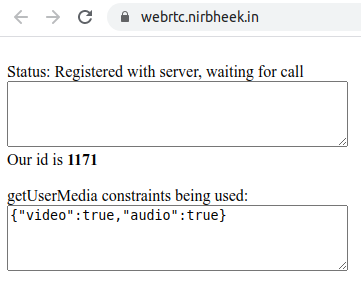
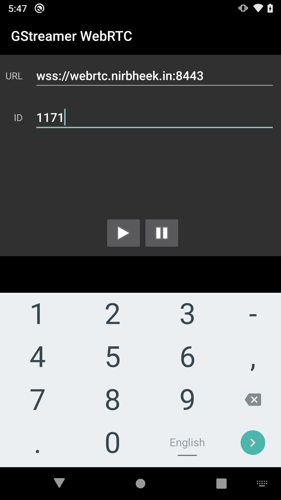

# GStreamer Android WebRTC demo

## 源码
源码位于`gst-examples`当中, 因此拉取`gst-examples`库:
```
$ git clone https://github.com/GStreamer/gst-examples.git
$ cd gst-examples
$ export ANDROID_HOME=~/Android/Sdk/
$ ./gradlew build
> Task :app:generateJsonModelDebug FAILED
/home/nickli/Android/Sdk/ndk-bundle/build/core/build-binary.mk:651: Android NDK: Module gstwebrtc depends on undefined modules: gstreamer_android    
... ...
/home/nickli/Android/Sdk/ndk-bundle/build/core/build-binary.mk:651: Android NDK: Module gstwebrtc depends on undefined modules: gstreamer_android    
/home/nickli/Android/Sdk/ndk-bundle/build/core/build-binary.mk:664: *** Android NDK: Note that old versions of ndk-build silently ignored this error case. If your project worked on those versions, the missing libraries were not needed and you can remove those dependencies from the module to fix your build. Alternatively, set APP_ALLOW_MISSING_DEPS=true to allow missing dependencies.    .  Stop.

FAILURE: Build failed with an exception.

* What went wrong:
Execution failed for task ':app:generateJsonModelDebug'.
> Build command failed.
  Error while executing process /home/nickli/Android/Sdk/ndk-bundle/
  
  ... ...

  /home/nickli/Android/Sdk/ndk-bundle/build/core/build-binary.mk:664: *** Android NDK: Note that old versions of ndk-build silently ignored this error case. If your project worked on those versions, the missing libraries were not needed and you can remove those dependencies from the module to fix your build. Alternatively, set APP_ALLOW_MISSING_DEPS=true to allow missing dependencies.    .  Stop.


* Try:
Run with --stacktrace option to get the stack trace. Run with --info or --debug option to get more log output. Run with --scan to get full insights.

* Get more help at https://help.gradle.org

Deprecated Gradle features were used in this build, making it incompatible with Gradle 6.0.
Use '--warning-mode all' to show the individual deprecation warnings.
See https://docs.gradle.org/5.6.4/userguide/command_line_interface.html#sec:command_line_warnings

BUILD FAILED in 1m 13s
4 actionable tasks: 4 executed
```

解决办法: 在`~/.gradle/gradle.properties`中添加配置:
```
gstAndroidRoot=/opt/work/gstreamer/gstreamer-1.0-android-universal-1.18.0/
```

其中`/opt/work/gstreamer/gstreamer-1.0-android-universal-1.18.0/`是下载好的:
```
$ mkdir -p /opt/work/gstreamer
$ cd /opt/work/gstreamer/
$ wget https://gstreamer.freedesktop.org/data/pkg/android/1.18.0/gstreamer-1.0-android-universal-1.18.0.tar.xz
$ cd gstreamer-1.0-android-universal-1.18.0
$ tar xvf ../gstreamer-1.0-android-universal-1.18.0.tar.xz
$ pwd
/opt/work/gstreamer/gstreamer-1.0-android-universal-1.18.0
$ ls arm64/share/gst-android/ndk-build/
androidmedia  fontconfig  gstreamer-1.0.mk  gstreamer_android-1.0.c.in  GStreamer.java  gstreamer_prebuilt.mk  plugins.mk  tools  tools.mk
```

然后再次编译:
```
$ ./gradlew build
```
参考链接: [从命令行构建您的应用](https://developer.android.com/studio/build/building-cmdline) 

编译安装完成后, 打开地址: [/webrtc.nirbheek.in](https://webrtc.nirbheek.in/), 可以看到:


可以看到服务器端等待id: `1171`

然后运行demo app, 输入id:  


点击连接按钮, 然后网页提示:`NotFoundError: Requested device not found`, 翻车...

## 电脑端链接摄像头后正常显示了
找了个同时的Mac帮忙测试, 本地买了个USB的摄像头:
```
$ ./webrtc-sendrecv --peer-id 6500
Connecting to server...
> GET  HTTP/1.1
> Soup-Debug-Timestamp: 1601207500
> Soup-Debug: SoupSession 1 (0x560fa8fae100), SoupMessage 1 (0x560fa92ca0b0), SoupSocket 1 (0x560fa8e01270)
> Host: webrtc.nirbheek.in:8443
> Upgrade: websocket
> Connection: Upgrade
> Sec-WebSocket-Key: br/+Aw23lA/5unBSHsPunw==
> Sec-WebSocket-Version: 13
> Accept-Encoding: gzip, deflate
  
< HTTP/1.1 101 Switching Protocols
< Soup-Debug-Timestamp: 1601207501
< Soup-Debug: SoupMessage 1 (0x560fa92ca0b0)
< Upgrade: websocket
< Connection: Upgrade
< Sec-WebSocket-Accept: RRua6TiWxHpxStUgnkIdT0VKYy0=
< Date: Sun, 27 Sep 2020 11:51:44 GMT
< Server: Python/3.7 websockets/8.1
  
Connected to signalling server
Registering id 6236 with server
Registered with server
Setting up signalling server call with 6500
Created data channel
Starting pipeline
Sending offer:
v=0
o=- 1822721616504051677 0 IN IP4 0.0.0.0
s=-
t=0 0
a=ice-options:trickle
a=group:BUNDLE video0 audio1 application2
m=video 9 UDP/TLS/RTP/SAVPF 96
c=IN IP4 0.0.0.0
a=setup:actpass
a=ice-ufrag:kHXidmNy0uB3V0yKRDNh0RTRGjmuO4+y
a=ice-pwd:w3rne6DG0KSf7+rpq9certJTm6ND7Lm3
a=rtcp-mux
a=rtcp-rsize
a=sendrecv
a=rtpmap:96 VP8/90000
a=rtcp-fb:96 nack pli
a=framerate:30
a=ssrc:3168726861 msid:user3709344541@host-a80e52b webrtctransceiver0
a=ssrc:3168726861 cname:user3709344541@host-a80e52b
a=mid:video0
a=fingerprint:sha-256 0C:A5:50:AD:43:53:D5:D2:CA:F0:1A:41:06:5F:CD:3F:31:80:A7:9C:CC:49:B8:C3:B2:C7:06:27:C9:45:4E:8B
m=audio 0 UDP/TLS/RTP/SAVPF 97
c=IN IP4 0.0.0.0
a=setup:actpass
a=ice-ufrag:kHXidmNy0uB3V0yKRDNh0RTRGjmuO4+y
a=ice-pwd:w3rne6DG0KSf7+rpq9certJTm6ND7Lm3
a=bundle-only
a=rtcp-mux
a=rtcp-rsize
a=sendrecv
a=rtpmap:97 OPUS/48000/2
a=rtcp-fb:97 nack pli
a=fmtp:97 sprop-maxcapturerate=48000;sprop-stereo=0
a=ssrc:4184637312 msid:user3709344541@host-a80e52b webrtctransceiver1
a=ssrc:4184637312 cname:user3709344541@host-a80e52b
a=mid:audio1
a=fingerprint:sha-256 0C:A5:50:AD:43:53:D5:D2:CA:F0:1A:41:06:5F:CD:3F:31:80:A7:9C:CC:49:B8:C3:B2:C7:06:27:C9:45:4E:8B
m=application 0 UDP/DTLS/SCTP webrtc-datachannel
c=IN IP4 0.0.0.0
a=setup:actpass
a=ice-ufrag:kHXidmNy0uB3V0yKRDNh0RTRGjmuO4+y
a=ice-pwd:w3rne6DG0KSf7+rpq9certJTm6ND7Lm3
a=bundle-only
a=mid:application2
a=sctp-port:5000
a=fingerprint:sha-256 0C:A5:50:AD:43:53:D5:D2:CA:F0:1A:41:06:5F:CD:3F:31:80:A7:9C:CC:49:B8:C3:B2:C7:06:27:C9:45:4E:8B

ICE gathering state changed to complete

** (webrtc-sendrecv:231609): WARNING **: 19:51:42.864: (gstdtlsconnection.c:530):gst_dtls_connection_process: runtime check failed: (!priv->bio_buffer)
Received answer:
v=0
o=- 8072212210074699327 2 IN IP4 127.0.0.1
s=-
t=0 0
a=group:BUNDLE video0 audio1 application2
a=msid-semantic: WMS 2Q4QpYTj9oRAZh8w732jGOj24udG29ED6HC4
m=video 56217 UDP/TLS/RTP/SAVPF 96
c=IN IP4 169.254.225.14
a=rtcp:9 IN IP4 0.0.0.0
a=candidate:2245810337 1 udp 2122260223 169.254.225.14 56217 typ host generation 0 network-id 2
a=candidate:215036887 1 udp 2122194687 192.168.1.128 61790 typ host generation 0 network-id 1 network-cost 10
a=ice-ufrag:KFW+
a=ice-pwd:AyMtPnKAlYfeajEc3NVRZBCY
a=ice-options:trickle
a=fingerprint:sha-256 BB:4E:7E:A7:FA:FD:53:B6:68:84:1F:CA:BC:E1:B9:BA:60:FC:8B:4A:08:F9:5F:36:4F:B3:BE:3E:46:0B:F5:9D
a=setup:active
a=mid:video0
a=sendrecv
a=rtcp-mux
a=rtcp-rsize
a=rtpmap:96 VP8/90000
a=rtcp-fb:96 nack pli
a=ssrc:4265893478 cname:cqkUb9fpLcfwM+OD
a=ssrc:4265893478 msid:2Q4QpYTj9oRAZh8w732jGOj24udG29ED6HC4 e4c5dc00-b8a1-43d3-9aea-5880d366c618
a=ssrc:4265893478 mslabel:2Q4QpYTj9oRAZh8w732jGOj24udG29ED6HC4
a=ssrc:4265893478 label:e4c5dc00-b8a1-43d3-9aea-5880d366c618
m=audio 9 UDP/TLS/RTP/SAVPF 97
c=IN IP4 0.0.0.0
a=rtcp:9 IN IP4 0.0.0.0
a=ice-ufrag:KFW+
a=ice-pwd:AyMtPnKAlYfeajEc3NVRZBCY
a=ice-options:trickle
a=fingerprint:sha-256 BB:4E:7E:A7:FA:FD:53:B6:68:84:1F:CA:BC:E1:B9:BA:60:FC:8B:4A:08:F9:5F:36:4F:B3:BE:3E:46:0B:F5:9D
a=setup:active
a=mid:audio1
a=sendrecv
a=rtcp-mux
a=rtpmap:97 OPUS/48000/2
a=fmtp:97 minptime=10;useinbandfec=1
a=ssrc:2974637563 cname:cqkUb9fpLcfwM+OD
a=ssrc:2974637563 msid:2Q4QpYTj9oRAZh8w732jGOj24udG29ED6HC4 0b061ae2-3cf1-4288-b5ce-863253842966
a=ssrc:2974637563 mslabel:2Q4QpYTj9oRAZh8w732jGOj24udG29ED6HC4
a=ssrc:2974637563 label:0b061ae2-3cf1-4288-b5ce-863253842966
m=application 9 UDP/DTLS/SCTP webrtc-datachannel
c=IN IP4 0.0.0.0
b=AS:30
a=ice-ufrag:KFW+
a=ice-pwd:AyMtPnKAlYfeajEc3NVRZBCY
a=ice-options:trickle
a=fingerprint:sha-256 BB:4E:7E:A7:FA:FD:53:B6:68:84:1F:CA:BC:E1:B9:BA:60:FC:8B:4A:08:F9:5F:36:4F:B3:BE:3E:46:0B:F5:9D
a=setup:active
a=mid:application2
a=sctp-port:5000

data channel opened
data channel opened
Received data channel message: Hi! (from browser)
Received data channel message: Hi! (from browser)
Received data channel message: Hi! (from browser)
Received data channel message: Hi! (from browser)

# 远端关闭

Trying to handle stream with audioconvert ! autoaudiosinkTrying to handle stream with videoconvert ! autovideosinkServer connection closed

(webrtc-sendrecv:231609): GLib-CRITICAL **: 19:52:51.854: g_main_loop_unref: assertion 'loop != NULL' failed
Data channel closed

(webrtc-sendrecv:231609): libsoup-CRITICAL **: 19:52:51.857: soup_websocket_connection_get_state: assertion 'SOUP_IS_WEBSOCKET_CONNECTION (self)' failed

(webrtc-sendrecv:231609): GLib-GObject-CRITICAL **: 19:52:51.857: g_object_unref: assertion 'G_IS_OBJECT (object)' failed
Data channel closed

(webrtc-sendrecv:231609): libsoup-CRITICAL **: 19:52:51.857: soup_websocket_connection_get_state: assertion 'SOUP_IS_WEBSOCKET_CONNECTION (self)' failed

(webrtc-sendrecv:231609): GLib-GObject-CRITICAL **: 19:52:51.857: g_object_unref: assertion 'G_IS_OBJECT (object)' failed
Pipeline stopped

```