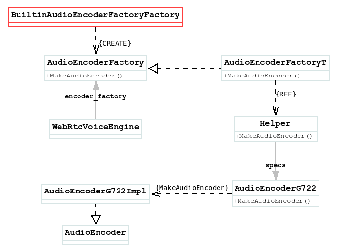

# BuiltinAudioEncoderFactoryFactory
构造函数:
```
@Override
public long createNativeAudioEncoderFactory() {
    return nativeCreateBuiltinAudioEncoderFactory();
}
```

接着看Native:
```
JNI_GENERATOR_EXPORT jlong 
        Java_org_webrtc_BuiltinAudioEncoderFactoryFactory_nativeCreateBuiltinAudioEncoderFactory(){
    return JNI_BuiltinAudioEncoderFactoryFactory_CreateBuiltinAudioEncoderFactory(env);
}
```

名字有点长:
```
static jlong
JNI_BuiltinAudioEncoderFactoryFactory_CreateBuiltinAudioEncoderFactory(
        JNIEnv* env) {
    return NativeToJavaPointer(CreateBuiltinAudioEncoderFactory().release());
}
```

接续:
```
rtc::scoped_refptr<AudioEncoderFactory> CreateBuiltinAudioEncoderFactory() {
    return CreateAudioEncoderFactory<
        ...
        AudioEncoderIsac, AudioEncoderG722,
        ...
        ();
```

创建了一个`AudioEncoderFactoryT`, 继承自:`AudioEncoderFactory`
```
class AudioEncoderFactoryT : public AudioEncoderFactory {
    ...
    std::vector<AudioCodecSpec> GetSupportedEncoders();
    absl::optional<AudioCodecInfo> QueryAudioEncoder(...);
    std::unique_ptr<AudioEncoder> MakeAudioEncoder(...);
}
```

接口上可以通过`AudioEncoderFactory.MakeAudioEncoder()`方法将`AudioCodecSpec`转化成为: `AudioEncoder`, 这在编码时是有用到的. 例如音频的**G722**格式, 会调用到`AudioEncoderG722::MakeAudioEncoder()`方法返回一个`AudioEncoderG722Impl{AudioEncoder}`类, 每个`AudioEncoder`都提供了重要的`EncodeImpl()`方法用于编码, 该方法被其父类的`AudioEncoder::Encode()`方法调用.

`AudioCodecSpec`转化成为: `AudioEncoderG722Impl`的过程:
从`AudioEncoderFactory`开始:
```
class AudioEncoderFactoryT : public AudioEncoderFactory {
  std::unique_ptr<AudioEncoder> MakeAudioEncoder(
      int payload_type,
      const SdpAudioFormat& format,
      absl::optional<AudioCodecPairId> codec_pair_id) override {
    return Helper<Ts...>::MakeAudioEncoder(payload_type, format, codec_pair_id);
  }
}
```

进一步到`Helper`:
```
struct Helper<T, Ts...> {
  static std::unique_ptr<AudioEncoder> MakeAudioEncoder(
      int payload_type,
      const SdpAudioFormat& format,
      absl::optional<AudioCodecPairId> codec_pair_id) {
    auto opt_config = T::SdpToConfig(format);
    if (opt_config) {
      return T::MakeAudioEncoder(*opt_config, payload_type, codec_pair_id);
    } else {
      return Helper<Ts...>::MakeAudioEncoder(payload_type, format,
                                             codec_pair_id);
    }
  }
}
```

最后到`AudioEncoderG722::MakeAudioEncoder()`:
```
struct RTC_EXPORT AudioEncoderG722 {
  using Config = AudioEncoderG722Config;
  ...
  static std::unique_ptr<AudioEncoder> MakeAudioEncoder(
      const AudioEncoderG722Config& config,
      int payload_type,
      absl::optional<AudioCodecPairId> codec_pair_id = absl::nullopt);
};

std::unique_ptr<AudioEncoder> AudioEncoderG722::MakeAudioEncoder(
    const AudioEncoderG722Config& config,
    int payload_type,
    absl::optional<AudioCodecPairId> /*codec_pair_id*/) {
  RTC_DCHECK(config.IsOk());
  return std::make_unique<AudioEncoderG722Impl>(config, payload_type);
}
```

到此位置, Native方法: `AudioEncoderFactory`就可以等待交付使用了, 类之间的关系图:
