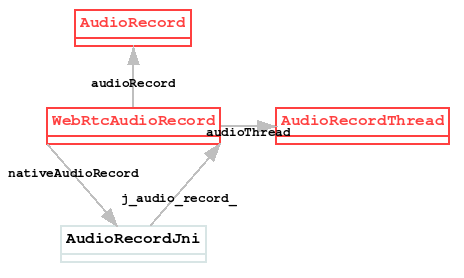
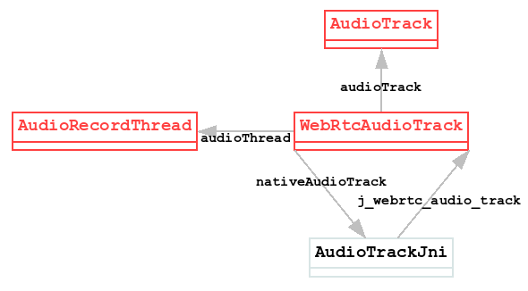
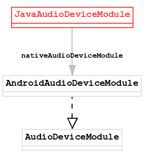
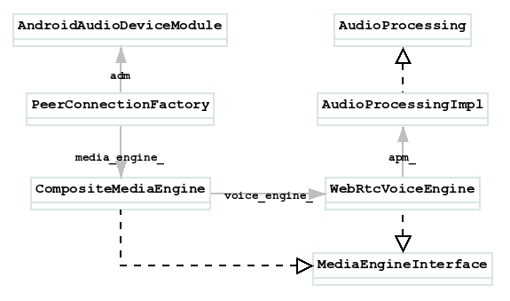
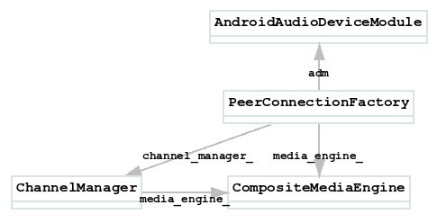
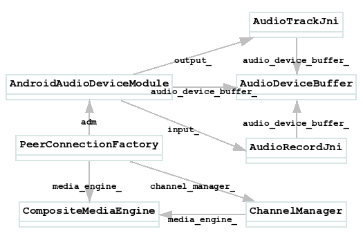
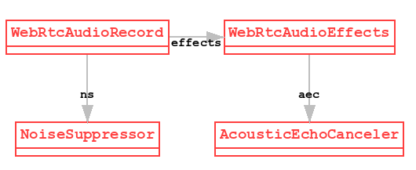
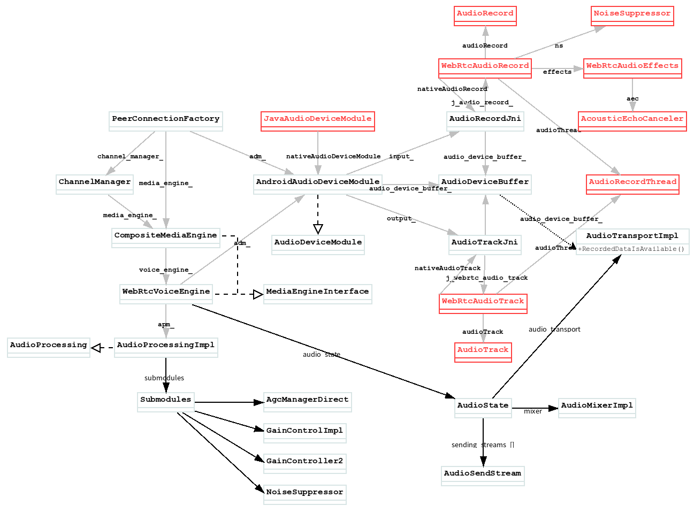
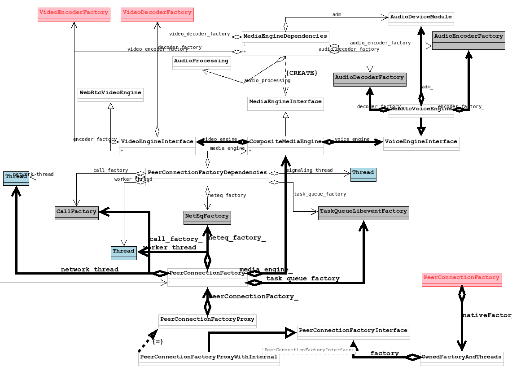

# PeerConnectionFactory.Builder: createPeerConnectionFactory()

## I/audio_record_jni.cc: (line 71): ctor
该log位于文件`sdk/android/src/jni/audio_device/audio_record_jni.cc`中, 可以看到其位于`AudioRecordJni`的构造函数当中, 那么`AudioRecordJni`是何时构造的? 这要从Java层的`JavaAudioDeviceModule`类说起, 首先`JavaAudioDeviceModule`是应用层通过`JavaAudioDeviceModule.buider()`方法构造的, 所以, 查看该方法
```
JavaAudioDeviceModule.builder(ContextUtils.getApplicationContext())
        .createAudioDeviceModule();
```
直接看`JavaAudioDeviceModule.Builder.createAudioDeviceModule()`:
```
public AudioDeviceModule createAudioDeviceModule() {
    ...
    final WebRtcAudioRecord audioInput = new WebRtcAudioRecord(context, audioManager, audioSource,
        audioFormat, audioRecordErrorCallback, audioRecordStateCallback, samplesReadyCallback,
        useHardwareAcousticEchoCanceler, useHardwareNoiseSuppressor);
    final WebRtcAudioTrack audioOutput = new WebRtcAudioTrack(
        context, audioManager, audioTrackErrorCallback, audioTrackStateCallback);
    return new JavaAudioDeviceModule(context, audioManager, audioInput, audioOutput,
        inputSampleRate, outputSampleRate, useStereoInput, useStereoOutput);
}

```
可以看到两个音频相关的类:
* WebRtcAudioRecord
    sdk/android/src/java/org/webrtc/audio/WebRtcAudioRecord.java
* WebRtcAudioTrack
    sdk/android/src/java/org/webrtc/audio/WebRtcAudioTrack.java

对于WebRtcAudioRecord.java, 其通过audioRecord成员引用了AudioRecord:
```
private @Nullable AudioRecord audioRecord;
```
在其`initRecording()`方法中根据SDK的版本进行了区分, 但无论那种方式, 最终都是创建了AudioRecord对象:
```
if (Build.VERSION.SDK_INT >= Build.VERSION_CODES.M) {
    // Use the AudioRecord.Builder class on Android M (23) and above.
    // Throws IllegalArgumentException.   n  
    audioRecord = createAudioRecordOnMOrHigher(
        audioSource, sampleRate, channelConfig, audioFormat, bufferSizeInBytes);
    if (preferredDevice != null) {
        setPreferredDevice(preferredDevice);
    }
} else {
    // Use the old AudioRecord constructor for API levels below 23.
    // Throws UnsupportedOperationException.
    audioRecord = createAudioRecordOnLowerThanM(
        audioSource, sampleRate, channelConfig, audioFormat, bufferSizeInBytes);
}
```
在`JavaAudioDeviceModule`的创建中, 只是记录了`WebRtcAudioRecord`到`JavaAudioDeviceModule.audioInput`而已, 并没有做实际的初始化.那么`initRecording()`何时被调用的呢? 其是在`JavaAudioRecord::InitRecording()`中被调用的, 那么`JavaAudioRecord`又是什么? 其实它是在创建`AudioRecordJni`时创建的, 这要从PeerConnectionFactory.Builder.createPeerConnectionFactory()方法说起, 该方法中:
```
public PeerConnectionFactory createPeerConnectionFactory() {
    ...
    return nativeCreatePeerConnectionFactory(ContextUtils.getApplicationContext(), options,
          audioDeviceModule.getNativeAudioDeviceModulePointer(),
          ...
    );
}
```

查看JavaAudioDeviceModule.getNativeAudioDeviceModulePointer():
```
@Override
public long getNativeAudioDeviceModulePointer() {
    synchronized (nativeLock) {
        if (nativeAudioDeviceModule == 0) {
        nativeAudioDeviceModule = nativeCreateAudioDeviceModule(context, audioManager, audioInput,
            audioOutput, inputSampleRate, outputSampleRate, useStereoInput, useStereoOutput);
        }
        return nativeAudioDeviceModule;
    }
}
```
查看native方法:
```
JNI_GENERATOR_EXPORT jlong
    Java_org_webrtc_audio_JavaAudioDeviceModule_nativeCreateAudioDeviceModule(...){
        return JNI_JavaAudioDeviceModule_CreateAudioDeviceModule(env,
            base::android::JavaParamRef<jobject>(env, context), base::android::JavaParamRef<jobject>(env,
            audioManager), base::android::JavaParamRef<jobject>(env, audioInput),
            base::android::JavaParamRef<jobject>(env, audioOutput), inputSampleRate, outputSampleRate,
            useStereoInput, useStereoOutput
    }
```

继续查看`JNI_JavaAudioDeviceModule_CreateAudioDeviceModule()`方法:
```
static jlong JNI_JavaAudioDeviceModule_CreateAudioDeviceModule(...){
    auto audio_input = std::make_unique<AudioRecordJni>(
                            env, input_parameters, kHighLatencyModeDelayEstimateInMilliseconds,
                            j_webrtc_audio_record);
    ...
}
```
创建了`AudioRecordJni`对象, 并通过`j_webrtc_audio_record`关联到了`JavaAudioDeviceModule.audioInput`所对应的`WebRtcAudioRecord`类
看下`AudioRecordJni`的构造函数:
````
AudioRecordJni::AudioRecordJni(AudioManager* audio_manager)...{
    RTC_LOG(INFO) << "ctor";
    ...
    Java_WebRtcAudioRecord_setNativeAudioRecord(env, j_audio_record_,
            jni::jlongFromPointer(this));
    thread_checker_.Detach();
    thread_checker_java_.Detach();
    ...
}
````

至此我们看到了我们关心的log, 此时的情形:  


## I/audio_track_jni.cc: (line 47): ctor
改log还是在`JNI_JavaAudioDeviceModule_CreateAudioDeviceModule()`方法中:
```
static jlong JNI_JavaAudioDeviceModule_CreateAudioDeviceModule(...){
    ...
    auto audio_output = std::make_unique<AudioTrackJni>(env, output_parameters,
            j_webrtc_audio_track);
    ...
}
```
查看`AudioTrackJni`的构造函数:
```
AudioTrackJni::AudioTrackJni(JNIEnv* env, ...){
    RTC_LOG(INFO) << "ctor";
    Java_WebRtcAudioTrack_setNativeAudioTrack(env, j_audio_track_,
            jni::jlongFromPointer(this));
    thread_checker_.Detach();
    thread_checker_java_.Detach();
}
```
此处我们看到了对应的log, 此时的情形:  
 

## I/audio_device_module.cc: (line 658): CreateAudioDeviceModuleFromInputAndOutput
还是在`JNI_JavaAudioDeviceModule_CreateAudioDeviceModule()`方法中:
```
static jlong JNI_JavaAudioDeviceModule_CreateAudioDeviceModule(...){
    ...
    return jlongFromPointer(CreateAudioDeviceModuleFromInputAndOutput(
            AudioDeviceModule::kAndroidJavaAudio,
            j_use_stereo_input, j_use_stereo_output,
            kHighLatencyModeDelayEstimateInMilliseconds,
            std::move(audio_input), std::move(audio_output))
            .release());
}
```

继续查看`CreateAudioDeviceModuleFromInputAndOutput()`方法:
```
rtc::scoped_refptr<AudioDeviceModule> CreateAudioDeviceModuleFromInputAndOutput(...){
    // 这是本小节的log
    RTC_LOG(INFO) << __FUNCTION__;
    return new rtc::RefCountedObject<AndroidAudioDeviceModule>(
        audio_layer, is_stereo_playout_supported, is_stereo_record_supported,
        playout_delay_ms, std::move(audio_input), std::move(audio_output));
}
```
创建了`AndroidAudioDeviceModule(AudioDeviceModule)`对象, 此时的情形:  
<!--  -->

## I/audio_device_module.cc: (line 73): AndroidAudioDeviceModule
继续上文, 查看`AndroidAudioDeviceModule`的构造函数:
```
AndroidAudioDeviceModule(AudioDeviceModule::AudioLayer audio_layer, ...){
    ...
    / 这是本小节的log
    RTC_LOG(INFO) << __FUNCTION__;
    thread_checker_.Detach();
}
```

这样其实`AudioRecordJni`就被设置给了`AndroidAudioDeviceModule{AudioDeviceModule}`的`input_`成员了
```
const std::unique_ptr<AudioInput> input_;
```

而WebRTC的Native真正需要的是AudioDeviceModule这个类. 对于`WebRtcAudioTrack`也是类似的情形. 那么`AudioDeviceModule`最后会关联到那个Native类中呢? 是下面这个:
```
// media/engine/webrtc_voice_engine.h
class WebRtcVoiceEngine final : public VoiceEngineInterface {
    rtc::scoped_refptr<webrtc::AudioDeviceModule> adm_;
    ...
}
```
此时的情形:


## I/audio_processing_impl.cc: (line 272): Injected APM submodules:
```
I/audio_processing_impl.cc: (line 272): Injected APM submodules:
    Echo control factory: 0
    Echo detector: 0
    Capture analyzer: 0
    Capture post processor: 0
    Render pre processor: 0
```
以上log在`AudioProcessingImpl`的构造函数中打印, 那么它是在什么时候构造的呢?, 这要从`PeerConnectionFactory`的构造说起, 通常`PeerConnectionFactory`的构造由`PeerConnectionFactory.Builder`完成, 那么检查该类的定义, 并且跟踪其构造流程
```
public class PeerConnectionFactory {
    ...
    public static class Builder {
        public Builder setVideoEncoderFactory(VideoEncoderFactory videoEncoderFactory) {
            this.videoEncoderFactory = videoEncoderFactory;
            return this;
        }
    }
    ...
}
```

然后在如下函数中使用:
```
public class PeerConnectionFactory {
    ...AndroidAudioDeviceModule
        base::android::JavaParamRef<jobject>(env, encoderFactory),
        ...
        nativeNetworkStatePredictorFactory, neteqFactory).Release();
}
```

名字有点长:
```
static ScopedJavaLocalRef<jobject>
        JNI_PeerConnectionFactory_CreatePeerConnectionFactory(...){
    return CreatePeerConnectionFactoryForJava(
        ...
        jencoder_factory, jdecoder_factory,
        // 在Native层创建了默认的audio_processor
        audio_processor ? audio_processor : CreateAudioProcessing(),
        ...
        TakeOwnershipOfUniquePtr<NetEqFactory>(native_neteq_factory));
}
```

查看`AudioProcessor`的创建:
```
rtc::scoped_refptr<AudioProcessing> CreateAudioProcessing() {
    return AudioProcessingBuilder().Create();
}
```

查看`Create()`方法:
```
AudioProcessing* AudioProcessingBuilder::Create(...){
    AudioProcessingImpl* apm = new rtc::RefCountedObject<AudioProcessingImpl>(
            config, std::move(capture_post_processing_),
            std::move(render_pre_processing_), std::move(echo_control_factory_),
            std::move(echo_detector_), std::move(capture_analyzer_));
    ...
    return apm;
}
```
创建了`AudioProcessingImpl{AudioProcessing}`实例并返回给了上层用作`CreatePeerConnectionFactoryForJava()`的参数.
最后查看的构造函数:
```
AudioProcessingImpl::AudioProcessingImpl(...){
    RTC_LOG(LS_INFO) << "Injected APM submodules:"
            "\nEcho control factory: "
            << !!echo_control_factory_
            << "\nEcho detector: " << !!submodules_.echo_detector
            << "\nCapture analyzer: " << !!submodules_.capture_analyzer
            << "\nCapture post processor: "
            << !!submodules_.capture_post_processor
            << "\nRender pre processor: "
            << !!submodules_.render_pre_processor;
    ...
}
```

印证了该log的出现. 

## I/webrtc_voice_engine.cc: (line 206): WebRtcVoiceEngine::WebRtcVoiceEngine
该log处于`WebRtcVoiceEngine`的构造过程中, 让我们回到`JNI_PeerConnectionFactory_CreatePeerConnectionFactory()`函数中:
```
static ScopedJavaLocalRef<jobject>
        JNI_PeerConnectionFactory_CreatePeerConnectionFactory(...){
    return CreatePeerConnectionFactoryForJava(
        ...
        jencoder_factory, jdecoder_factory,
        // 在Native层创建了默认的audio_processor
        audio_processor ? audio_processor : CreateAudioProcessing(),
        ...
        TakeOwnershipOfUniquePtr<NetEqFactory>(native_neteq_factory));
}
```

跟进这最后一句:
```
ScopedJavaLocalRef<jobject> CreatePeerConnectionFactoryForJava(...){
    ...
    dependencies.media_engine = 
        cricket::CreateMediaEngine(std::move(media_dependencies));
    ...
}
```

查看创建函数:
```
std::unique_ptr<MediaEngineInterface> CreateMediaEngine(...){
    auto audio_engine = std::make_unique<WebRtcVoiceEngine>(
            dependencies.task_queue_factory, std::move(dependencies.adm),
            std::move(dependencies.audio_encoder_factory),
            std::move(dependencies.audio_decoder_factory),
            std::move(dependencies.audio_mixer),
            std::move(dependencies.audio_processing));
    ...
    return std::make_unique<CompositeMediaEngine>(std::move(audio_engine),
            std::move(video_engine));
}
```
终于看到了的构造:
```
WebRtcVoiceEngine::WebRtcVoiceEngine(...){
    ...
    RTC_LOG(LS_INFO) << "WebRtcVoiceEngine::WebRtcVoiceEngine";
    ...
}
```

此时的情形:  


## I/webrtc_video_engine.cc: (line 571): WebRtcVideoEngine::WebRtcVideoEngine()
仅接上文的`CreateMediaEngine()`函数:
```
std::unique_ptr<MediaEngineInterface> CreateMediaEngine(...){
    ...
    auto video_engine = std::make_unique<WebRtcVideoEngine>(
            std::move(dependencies.video_encoder_factory),
            std::move(dependencies.video_decoder_factory));
    ...
}
```
查看`WebRtcVideoEngine`的构造函数:
```
WebRtcVideoEngine::WebRtcVideoEngine(...){
    RTC_LOG(LS_INFO) << "WebRtcVideoEngine::WebRtcVideoEngine()";
}
```

## I/webrtc_voice_engine.cc: (line 228): WebRtcVoiceEngine::Init
`WebRtcVoiceEngine`是何时被初始化的? 其实还是在上文提到的`CreatePeerConnectionFactoryForJava()`之中, 被`CreateModularPeerConnectionFactory()`初始化:
```
ScopedJavaLocalRef<jobject> CreatePeerConnectionFactoryForJava(...){
    ...
    dependencies.media_engine = 
        cricket::CreateMediaEngine(std::move(media_dependencies));
    rtc::scoped_refptr<PeerConnectionFactoryInterface> factory =
        CreateModularPeerConnectionFactory(std::move(dependencies));
    return NativeToScopedJavaPeerConnectionFactory(
        jni, factory, std::move(network_thread), std::move(worker_thread),
        std::move(signaling_thread), network_monitor_factory);
}
```

那么查看`CreateModularPeerConnectionFactory()`函数:
```
rtc::scoped_refptr<PeerConnectionFactoryInterface>
CreateModularPeerConnectionFactory(...){
    rtc::scoped_refptr<PeerConnectionFactory> pc_factory(
            new rtc::RefCountedObject<PeerConnectionFactory>(
                std::move(dependencies)));
    // 此处调用了: PeerConnectionFactory::Initialize()
    MethodCall<PeerConnectionFactory, bool> call(
            pc_factory.get(), &PeerConnectionFactory::Initialize);
    bool result = call.Marshal(RTC_FROM_HERE, pc_factory->signaling_thread());
    ...
    return PeerConnectionFactoryProxy::Create(pc_factory->signaling_thread(), pc_factory);
}
```

检查`PeerConnectionFactory::Initialize()`:
```
bool PeerConnectionFactory::Initialize() {
    ...
    channel_manager_ = std::make_unique<cricket::ChannelManager>(
            std::move(media_engine_), std::make_unique<cricket::RtpDataEngine>(),
    worker_thread_, network_thread_);
    channel_manager_->SetVideoRtxEnabled(true);
    channel_manager_->Init()
}
```

创建了`ChannelManager`, 传入了`media_engine_`, 那么`media_engine_`是何时设置在`PeerConnectionFactory`之中的, 显然是在`CreateModularPeerConnectionFactory()`函数中, 查看`PeerConnectionFactory`的构造函数:
```
PeerConnectionFactory::PeerConnectionFactory(
        ...
        // 显然dependencies.media_engine是上文CreateMediaEngine()创建的CompositeMediaEngine
        media_engine_(std::move(dependencies.media_engine)),
        ...){
    ...
}
```

所以`PeerConnectionFactory::Initialize()`中的`channel_manager_->Init()`对应的也就是`CompositeMediaEngine::Init()`了:
```
bool CompositeMediaEngine::Init() {
    voice().Init();
    return true;
}
```
而`voice().Init()`正是`WebRtcVoiceEngine::Init()`
```
void WebRtcVoiceEngine::Init() {
    ...
    RTC_LOG(LS_INFO) << "WebRtcVoiceEngine::Init";
    ...
}
```
类图:  


## I/audio_device_module.cc: (line 92): Init
此处的log实际上是`AndroidAudioDeviceModule`的初始化, 它是在何时被调用的? 其实就是在上文的`WebRtcVoiceEngine::Init()`之中:
```
void WebRtcVoiceEngine::Init() {
    ...
    webrtc::adm_helpers::Init(adm());
}
```
`adm()`返回了构造WebRtcVoiceEngine是传入的`AndroidAudioDeviceModule`, 查看`webrtc::adm_helpers::Init)`:
```
// media/engine/adm_helpers.cc:
void Init(AudioDeviceModule* adm) {
    ...
    RTC_CHECK_EQ(0, adm->Init()) << "Failed to initialize the ADM.";
    ...
}
```

查看`AndroidAudioDeviceModule`的`Init()`方法:
```
// sdk/android/src/jni/audio_device/audio_device_module.cc:92
int32_t Init() override {
    RTC_LOG(INFO) << __FUNCTION__;
    ...
}
```

## I/audio_device_buffer.cc: (line 65): AudioDeviceBuffer::ctor
仅接上一小节的`AndroidAudioDeviceModule::Init()`方法:
```
int32_t Init() override {
    ...
    audio_device_buffer_ =
            std::make_unique<AudioDeviceBuffer>(task_queue_factory_.get());
}
```

查看`AudioDeviceBuffer`的构造函数:
```
AudioDeviceBuffer::AudioDeviceBuffer(...){
    RTC_LOG(INFO) << "AudioDeviceBuffer::ctor";
    ...
}
```

## I/audio_device_module.cc: (line 594): AttachAudioBuffer
仅接上一小节的`Init()`方法:
```
int32_t Init() override {
    ...
    audio_device_buffer_ =
            std::make_unique<AudioDeviceBuffer>(task_queue_factory_.get());
    AttachAudioBuffer();
}
```
查看`AttachAudioBuffer()`方法:
```
int32_t AttachAudioBuffer() {
    RTC_LOG(INFO) << __FUNCTION__;
    output_->AttachAudioBuffer(audio_device_buffer_.get());
    input_->AttachAudioBuffer(audio_device_buffer_.get());
    return 0;
}
```

## I/audio_track_jni.cc: (line 208): AttachAudioBuffer
对应上文的`output_->AttachAudioBuffer(...);`
对于Android SDK查看`AudioTrackJni::AttachAudioBuffer()`方法:
```
void AudioTrackJni::AttachAudioBuffer(AudioDeviceBuffer* audioBuffer) {
    RTC_LOG(INFO) << "AttachAudioBuffer";
    ...
    RTC_LOG(INFO) << "SetPlayoutSampleRate(" << sample_rate_hz << ")";
    ...
    RTC_LOG(INFO) << "SetPlayoutChannels(" << channels << ")";
    ...
}
```
分贝对应log:
```
I/audio_track_jni.cc: (line 208): AttachAudioBuffer
I/audio_track_jni.cc: (line 212): SetPlayoutSampleRate(48000)
I/audio_track_jni.cc: (line 215): SetPlayoutChannels(1)
```

## I/audio_record_jni.cc: (line 191): AttachAudioBuffer
对于`AudioRecordJni`也是类似的情况:
```
void AudioRecordJni::AttachAudioBuffer(AudioDeviceBuffer* audioBuffer) {
    RTC_LOG(INFO) << "AttachAudioBuffer";
    ...
    RTC_LOG(INFO) << "SetRecordingSampleRate(" << sample_rate_hz << ")";
    ...
    RTC_LOG(INFO) << "SetRecordingChannels(" << channels << ")";
    audio_device_buffer_->SetRecordingChannels(channels);
    ...
}
```

类图:  



## I/audio_device_buffer.cc: (line 201): SetRecordingChannels(1)
接上文`audio_device_buffer_->SetRecordingChannels()`方法:
```
int32_t AudioDeviceBuffer::SetRecordingChannels(size_t channels) {
    RTC_LOG(INFO) << "SetRecordingChannels(" << channels << ")";
    rec_channels_ = channels;
    return 0;
}
```

## I/audio_track_jni.cc: (line 64): Init
Attach完成Buffer后, 将对`AudioTrackJni`和`AudioRecordJni`进行初始化, 此log为AudioTrackJni的初始化, 还是查看`AndroidAudioDeviceModule`的`Init()`
```
int32_t Init() override {
    ...
    AttachAudioBuffer();
    ...
    output_->Init();
    input_->Init();
    ...
```
查看`AudioTrackJni::Init()`:
```
int32_t AudioTrackJni::Init() {
    RTC_LOG(INFO) << "Init";
    env_ = AttachCurrentThreadIfNeeded();
    RTC_DCHECK(thread_checker_.IsCurrent());
    return 0;
}
```
可以看到对应的log.

## I/audio_record_jni.cc: (line 88): Init
同上一小节:
```
int32_t AudioRecordJni::Init() {
    RTC_LOG(INFO) << "Init";
    env_ = AttachCurrentThreadIfNeeded();
    RTC_DCHECK(thread_checker_.IsCurrent());
    return 0;
}
```

## I/audio_device_module.cc: (line 168): SetPlayoutDevice(0)
```
void WebRtcVoiceEngine::Init() {
    ...
    webrtc::adm_helpers::Init(adm());
    ...
    adm->SetPlayoutDevice(AUDIO_DEVICE_ID);
    // I/audio_device_module.cc: (line 321): InitSpeaker
    adm->InitSpeaker();
    // I/audio_device_module.cc: (line 458): StereoPlayoutIsAvailable
    // I/audio_device_module.cc: (line 460): output: 0
    adm->StereoPlayoutIsAvailable(&available);
    // I/audio_device_module.cc: (line 465): SetStereoPlayout(0)
    adm->SetStereoPlayout(available);

    // I/audio_device_module.cc: (line 181): SetRecordingDevice(0)
    adm->SetRecordingDevice(AUDIO_DEVICE_ID);
    // I/audio_device_module.cc: (line 331): InitMicrophone
    adm->InitMicrophone();
    // I/audio_device_module.cc: (line 485): StereoRecordingIsAvailable
    // I/audio_device_module.cc: (line 487): output: 0
    adm->StereoRecordingIsAvailable(&available);
    // I/audio_device_module.cc: (line 492): SetStereoRecording(0)
    adm->SetStereoRecording(available);
}
```

## I/audio_device_module.cc: (line 87): RegisterAudioCallback
此时仍然处于`WebRtcVoiceEngine::Init()`上下文之中:
```
void WebRtcVoiceEngine::Init() {
    ...
    webrtc::adm_helpers::Init(adm());
    ...
    adm()->RegisterAudioCallback(audio_state()->audio_transport());
    ...
}
```
查看`AndroidAudioDeviceModule`的`RegisterAudioCallback()`方法:
```
int32_t RegisterAudioCallback(AudioTransport* audioCallback) override {
    RTC_LOG(INFO) << __FUNCTION__;
    return audio_device_buffer_->RegisterAudioCallback(audioCallback);
}
```

## I/audio_device_buffer.cc: (line 82): RegisterAudioCallback
继续上一小节查看`AudioDeviceBuffer::RegisterAudioCallback()`方法:
```
int32_t AudioDeviceBuffer::RegisterAudioCallback(...){
    ...
    RTC_LOG(INFO) << __FUNCTION__;
    ...
}
}
```

## I/webrtc_voice_engine.cc: (line 315): WebRtcVoiceEngine::ApplyOptions: AudioOptions {aec: 1, agc: 1, ns: 1, hf: 1, swap: 0, audio_jitter_buffer_max_packets: 200, audio_jitter_buffer_fast_accelerate: 0, audio_jitter_buffer_min_delay_ms: 0, audio_jitter_buffer_enable_rtx_handling: 0, typing: 1, experimental_agc: 0, experimental_ns: 0, residual_echo_detector: 1, }
此时仍然处于`WebRtcVoiceEngine::Init()`上下文之中:
```
void WebRtcVoiceEngine::Init() {
    ...
    adm()->RegisterAudioCallback(audio_state()->audio_transport());
    ...
    AudioOptions options;
    options.echo_cancellation = true;
    options.auto_gain_control = true;
    options.noise_suppression = true;
    options.highpass_filter = true;
    options.stereo_swapping = false;
    options.audio_jitter_buffer_max_packets = 200;
    options.audio_jitter_buffer_fast_accelerate = false;
    options.audio_jitter_buffer_min_delay_ms = 0;
    options.audio_jitter_buffer_enable_rtx_handling = false;
    options.typing_detection = true;
    options.experimental_agc = false;
    options.experimental_ns = false;
    options.residual_echo_detector = true;
    bool error = ApplyOptions(options);
    ...
}
```
显而易见:
```
bool WebRtcVoiceEngine::ApplyOptions(const AudioOptions& options_in) {
    ...
    RTC_LOG(LS_INFO) << "WebRtcVoiceEngine::ApplyOptions: "
            << options_in.ToString();
    ...
}
```

## I/audio_device_module.cc: (line 531): BuiltInAECIsAvailable
AEC的初始化, 继续上一小节的`WebRtcVoiceEngine::ApplyOptions()`:
```
bool WebRtcVoiceEngine::ApplyOptions(const AudioOptions& options_in) {
    ...
    if (options.echo_cancellation)
        const bool built_in_aec = adm()->BuiltInAECIsAvailable();
    ...
}
```


查看`AndroidAudioDeviceModule::BuiltInAECIsAvailable()`
```
bool BuiltInAECIsAvailable() const override {
    // 此处为log打印
    RTC_LOG(INFO) << __FUNCTION__;
    if (!initialized_)
        return false;
    bool isAvailable = input_->IsAcousticEchoCancelerSupported();
    // I/audio_device_module.cc: (line 535): output: 1
    RTC_LOG(INFO) << "output: " << isAvailable;
    return isAvailable;
}
```

## I/audio_device_module.cc: (line 561): EnableBuiltInAEC(1)
继续上一小节的`WebRtcVoiceEngine::ApplyOptions()`:
```
bool WebRtcVoiceEngine::ApplyOptions(const AudioOptions& options_in) {
    ...
    if (options.echo_cancellation)
        const bool built_in_aec = adm()->BuiltInAECIsAvailable();
        if (built_in_aec)
            adm()->EnableBuiltInAEC(enable_built_in_aec);
            ...
    ...
}
```

查看`AndroidAudioDeviceModule::EnableBuiltInAEC()`
```
int32_t EnableBuiltInAEC(bool enable) override {
    RTC_LOG(INFO) << __FUNCTION__ << "(" << enable << ")";
    ...
    int32_t result = input_->EnableBuiltInAEC(enable);
    RTC_LOG(INFO) << "output: " << result;
    return result;
}
```

## I/audio_record_jni.cc: (line 215): EnableBuiltInAEC(1)
进一步查看:
```
int32_t AudioRecordJni::EnableBuiltInAEC(bool enable) {
    RTC_LOG(INFO) << "EnableBuiltInAEC(" << enable << ")";
    ...
    return Java_WebRtcAudioRecord_enableBuiltInAEC(env_, j_audio_record_, enable)
            ? 0
            : -1;
}
```

继续查看:`Java_WebRtcAudioRecord_enableBuiltInAEC()`:
```
static jboolean Java_WebRtcAudioRecord_enableBuiltInAEC(...){
    jboolean ret =
            env->CallBooleanMethod(obj.obj(), call_context.base.method_id, enable);
}
```

## I/org.webrtc.Logging: WebRtcAudioRecordExternal: enableBuiltInAEC(true)
注: `WebRtcAudioRecord`的TAG是:`WebRtcAudioRecordExternal`
调用到了Java层的:`WebRtcAudioRecord.enableBuiltInAEC()`
```
@CalledByNative
private boolean enableBuiltInAEC(boolean enable) {
    Logging.d(TAG, "enableBuiltInAEC(" + enable + ")");
    return effects.setAEC(enable);
}
```

## I/org.webrtc.Logging: WebRtcAudioEffectsExternal: setAEC(true)
`effects`是`WebRtcAudioEffects`, 在`WebRtcAudioRecord`的构造过程中构造, 查看构造函数:
```
// WebRtcAudioEffects.java
private WebRtcAudioEffects() {
    // [LOG]: WebRtcAudioEffectsExternal: ctor@[name=main, id=2]
    Logging.d(TAG, "ctor" + WebRtcAudioUtils.getThreadInfo());
}
```

## I/audio_device_module.cc: (line 566): output: 0
查看`AndroidAudioDeviceModule::EnableBuiltInAEC()`
```
int32_t EnableBuiltInAEC(bool enable) override {
    RTC_LOG(INFO) << __FUNCTION__ << "(" << enable << ")";
    ...
    int32_t result = input_->EnableBuiltInAEC(enable);
    // [LOG]: 566行
    RTC_LOG(INFO) << "output: " << result;
    return result;
}
```
类图:


## I/webrtc_voice_engine.cc: (line 397): Disabling EC since built-in EC will be used instead
此时位于`WebRtcVoiceEngine::ApplyOptions()`的上下文中:
```
bool WebRtcVoiceEngine::ApplyOptions(const AudioOptions& options_in) {
    ...
    if (options.auto_gain_control)
        bool built_in_agc_avaliable = adm()->BuiltInAGCIsAvailable();
        ...
        if (adm()->EnableBuiltInAEC(enable_built_in_aec) == 0 &&
                enable_built_in_aec) {
            ...
            RTC_LOG(LS_INFO)
                    << "Disabling EC since built-in EC will be used instead";
        }
    ...
}
```

## I/audio_device_module.cc: (line 541): BuiltInAGCIsAvailable
## I/audio_device_module.cc: (line 542): output: 0
此时位于`WebRtcVoiceEngine::ApplyOptions()`的上下文中:
```
bool WebRtcVoiceEngine::ApplyOptions(const AudioOptions& options_in) {
    ...
    if (options.auto_gain_control)
        bool built_in_agc_avaliable = adm()->BuiltInAGCIsAvailable();
        ...
    ...
}
```

查看`::BuiltInAGCIsAvailable()`:
```
bool BuiltInAGCIsAvailable() const override {
    RTC_LOG(INFO) << __FUNCTION__;
    RTC_LOG(INFO) << "output: " << false;
    return false;
}
```

## I/audio_device_module.cc: (line 551): BuiltInNSIsAvailable
## I/audio_device_module.cc: (line 555): output: 1
## I/audio_device_module.cc: (line 578): EnableBuiltInNS(1)
## I/audio_device_module.cc: (line 551): BuiltInNSIsAvailable
## I/audio_device_module.cc: (line 555): output: 1
## I/audio_record_jni.cc: (line 223): EnableBuiltInNS(1)
## I/org.webrtc.Logging: WebRtcAudioRecordExternal: enableBuiltInNS(true)
## I/org.webrtc.Logging: WebRtcAudioEffectsExternal: setNS(true)
## I/audio_device_module.cc: (line 583): output: 0
## I/webrtc_voice_engine.cc: (line 424): Disabling NS since built-in NS will be used instead
以上处理和上文情况基本相同

## I/webrtc_voice_engine.cc: (line 431): Stereo swapping enabled? 0
继续查看`WebRtcVoiceEngine::ApplyOptions()`:
```
bool WebRtcVoiceEngine::ApplyOptions(const AudioOptions& options_in) {
    ...
    if (options.stereo_swapping) {
        RTC_LOG(LS_INFO) << "Stereo swapping enabled? " << *options.stereo_swapping;
        audio_state()->SetStereoChannelSwapping(*options.stereo_swapping);
    }
    ...
}
```

## I/webrtc_voice_engine.cc: (line 436): NetEq capacity is 200
## I/webrtc_voice_engine.cc: (line 442): NetEq fast mode? 0
## I/webrtc_voice_engine.cc: (line 448): NetEq minimum delay is 0
## I/webrtc_voice_engine.cc: (line 454): NetEq handle reordered packets? 0
## I/webrtc_voice_engine.cc: (line 474): Experimental ns is enabled? 0
## I/webrtc_voice_engine.cc: (line 525): NS set to 0
## I/webrtc_voice_engine.cc: (line 529): Typing detection is enabled? 0
以上处理和上文情况基本相同

## I/audio_processing_impl.cc: (line 526): AudioProcessing::ApplyConfig:
本行log过长, 因此不再标题中体现:
``` 
I/audio_processing_impl.cc: (line 526): AudioProcessing::ApplyConfig: 
AudioProcessing::Config{ pipeline: {maximum_internal_processing_rate: 32000, multi_channel_render: 0, , multi_channel_capture: 0}, pre_amplifier: { enabled: 0, fixed_gain_factor: 1 }, high_pass_filter: { enabled: 1 }, echo_canceller: { enabled: 0, mobile_mode: 1, enforce_high_pass_filtering: 1 }, noise_suppression: { enabled: 0, level: High }, transient_suppression: { enabled: 0 }, voice_detection: { enabled: 0 }, gain_controller1: { enabled: 1, mode: FixedDigital, target_level_dbfs: 3, compression_gain_db: 9, enable_limiter: 1, analog_level_minimum: 0, analog_level_maximum: 255 }, gain_controller2: { enabled: 0, fixed_digital: { gain_db: 0 }, adaptive_digital: { enabled: 0, level_estimator: Rms, use_saturation_protector: 1, extra_saturation_margin_db: 2 } }, residual_echo_detector: { enabled: 1 }, level_estimation: { enabled: 0 } }
```
继续查看`WebRtcVoiceEngine::ApplyOptions()`:
```
bool WebRtcVoiceEngine::ApplyOptions(const AudioOptions& options_in) {
    // 构造apm_config并设置给: AudioProcessingImpl
    ...
    ap->SetExtraOptions(config);
    ap->ApplyConfig(apm_config);
}
```

查看设置配置函数:
```
void AudioProcessingImpl::ApplyConfig(const AudioProcessing::Config& config) {
    // RTC_LOG(LS_INFO) << "AudioProcessing::ApplyConfig: " << config.ToString();
    ...
}
```

## I/agc_manager_direct.cc: (line 69): [agc] GetMinMicLevel
接上节`AudioProcessingImpl::ApplyConfig()`:
```
void AudioProcessingImpl::ApplyConfig(...) {
    ...
    if (agc1_config_changed) {
        InitializeGainController1();
    }
}
```

继续:
```
void AudioProcessingImpl::InitializeGainController1() {
    ...
    submodules_.agc_manager.reset(new AgcManagerDirect(...), ...);
    ...
}
```
继续:
```
AgcManagerDirect::AgcManagerDirect(...){
    const int min_mic_level = GetMinMicLevel();
    ...
}
```
继续:
```
int GetMinMicLevel() {
    RTC_LOG(LS_INFO) << "[agc] GetMinMicLevel";
    ...
}
```

## I/agc_manager_direct.cc: (line 73): [agc] Using default min mic level: 12
接上节`GetMinMicLevel()`:
```
int GetMinMicLevel() {
    RTC_LOG(LS_INFO) << "[agc] GetMinMicLevel";
    ...
    if (!webrtc::field_trial::IsEnabled(kMinMicLevelFieldTrial))
        RTC_LOG(LS_INFO) << "[agc] Using default min mic level: " << kMinMicLevel;
        ...
    ...
}
```

## I/agc_manager_direct.cc: (line 457): AgcManagerDirect::Initialize
```
void AudioProcessingImpl::InitializeGainController1() {
    ...
    submodules_.agc_manager.reset(new AgcManagerDirect(...), ...);
    submodules_.agc_manager->Initialize();
    ...
}
```

查看初始化函数:
```
void AgcManagerDirect::Initialize() {
    RTC_DLOG(LS_INFO) << "AgcManagerDirect::Initialize";
    ...
}
```

此时的类图:  
<!--  -->


## PeerConnectionFactory: onNetworkThreadReady
## PeerConnectionFactory: onSignalingThreadReady
## PeerConnectionFactory: onWorkerThreadReady
此时逐次返回到`CreatePeerConnectionFactoryForJava()`中:
```
ScopedJavaLocalRef<jobject> CreatePeerConnectionFactoryForJava(...){
    ...
    dependencies.media_engine = 
        cricket::CreateMediaEngine(std::move(media_dependencies));
    rtc::scoped_refptr<PeerConnectionFactoryInterface> factory =
        CreateModularPeerConnectionFactory(std::move(dependencies));
    return NativeToScopedJavaPeerConnectionFactory(
        jni, factory, std::move(network_thread), std::move(worker_thread),
        std::move(signaling_thread), network_monitor_factory);
}
```

# PeerConnectionFactory: createPeerConnection()
## I/rtc_event_log_impl.cc: (line 43): Creating legacy encoder for RTC event log.
在worker_thread_上创建Logger, 这是由`createPeerConnection()`触发的, 从Java层开始:
```
@Nullable
public PeerConnection createPeerConnection(
        PeerConnection.RTCConfiguration rtcConfig, PeerConnection.Observer observer) {
    return createPeerConnection(rtcConfig, null /* constraints */, observer);
}
```

继续:
```
@Nullable
@Deprecated
public PeerConnection createPeerConnection(PeerConnection.RTCConfiguration rtcConfig,
    MediaConstraints constraints, PeerConnection.Observer observer) {
    return createPeerConnectionInternal(
            rtcConfig, constraints, observer, /* sslCertificateVerifier= */ null);
}
```

继续:
```
@Nullable
PeerConnection createPeerConnectionInternal(PeerConnection.RTCConfiguration rtcConfig,
        MediaConstraints constraints, PeerConnection.Observer observer,
        SSLCertificateVerifier sslCertificateVerifier) {
    checkPeerConnectionFactoryExists();
    long nativeObserver = PeerConnection.createNativePeerConnectionObserver(observer);
    if (nativeObserver == 0) {
        return null;
    }
    long nativePeerConnection = nativeCreatePeerConnection(
            nativeFactory, rtcConfig, constraints, nativeObserver, sslCertificateVerifier);
    if (nativePeerConnection == 0) {
        return null;
    }
    return new PeerConnection(nativePeerConnection);
}
```

到达了`nativeCreatePeerConnection()`方法, 查看JNI接口:
```
JNI_GENERATOR_EXPORT jlong Java_org_webrtc_PeerConnectionFactory_nativeCreatePeerConnection(...){
    return JNI_PeerConnectionFactory_CreatePeerConnection(env, factory,
        base::android::JavaParamRef<jobject>(env, rtcConfig),
        base::android::JavaParamRef<jobject>(env, constraints), nativeObserver,
        base::android::JavaParamRef<jobject>(env, sslCertificateVerifier));
}
```

查看`JNI_PeerConnectionFactory_CreatePeerConnection()`方法:
```
static jlong JNI_PeerConnectionFactory_CreatePeerConnection(...){
    // 准备一个RTCConfiguration
    PeerConnectionInterface::RTCConfiguration rtc_config(
            PeerConnectionInterface::RTCConfigurationType::kAggressive);
    // 将Java层的PeerConnection.RTCConfiguration转化为: PeerConnectionInterface::RTCConfiguration, 其中包括IceServerList信息
    JavaToNativeRTCConfiguration(jni, j_rtc_config, &rtc_config);
    ...
    // 同样的完成Java层MediaConstraints到Native的转换
    std::unique_ptr<MediaConstraints> constraints;
    ...
    // 创建一个PeerConnectionDependencies
    PeerConnectionDependencies peer_connection_dependencies(observer.get());
    // 将Java层的SSLCertificateVerifier转换到Native并配置给刚创建的PeerConnectionDependencies
    peer_connection_dependencies.tls_cert_verifier =
            std::make_unique<SSLCertificateVerifierWrapper>(jni, j_sslCertificateVerifier);
    ...
    // 创建PeerConnectionInterface接口的实现: PeerConnection{PeerConnectionInternal}{PeerConnectionInterface}
    rtc::scoped_refptr<PeerConnectionInterface> pc =
            PeerConnectionFactoryFromJava(factory)->CreatePeerConnection(
            rtc_config, std::move(peer_connection_dependencies));
    // 创建一个OwnedPeerConnection并设置到Java层用于构造PeerConnection类的参数
    return jlongFromPointer(
            new OwnedPeerConnection(pc, std::move(observer), std::move(constraints)));
}
```

`PeerConnectionFactoryFromJava()`将Java层的`PeerConnectionFactory`转化为Native层的`PeerConnectionFactoryProxy{PeerConnectionFactoryInterface}`, 特别的, `PeerConnectionFactoryProxy{PeerConnectionFactoryInterface}`是在`OwnedFactoryAndThreads`类中的, 该函数处理了这个情况. 继续查看`CreatePeerConnection()`, 对于`PeerConnectionFactoryProxy`所有的操作都会被映射到`PeerConnectionFactory`类中, 因此, 查看`PeerConnectionFactory::CreatePeerConnection()`方法:
```
rtc::scoped_refptr<PeerConnectionInterface>
PeerConnectionFactory::CreatePeerConnection(...){
    // 构造了PeerConnectionDependencies然后进一步传递
    PeerConnectionDependencies dependencies(observer);
    dependencies.allocator = std::move(allocator);
    dependencies.cert_generator = std::move(cert_generator);
    return CreatePeerConnection(configuration, std::move(dependencies));
}
```

进一步构造:
```
rtc::scoped_refptr<PeerConnectionInterface>
PeerConnectionFactory::CreatePeerConnection(...){
    ...
    // 如果没有创建, 则
    if (!dependencies.allocator) {
        // 在network_thread_上执行一个lambada函数, 创建一个: P2PPortAllocator{BasicPortAllocator} 并设置给PeerConnectionDependencies::allocator
        network_thread_->Invoke<void>(RTC_FROM_HERE, [this, &configuration,
                &dependencies,
                &packet_socket_factory]() {
                dependencies.allocator = std::make_unique<cricket::BasicPortAllocator>(
                default_network_manager_.get(), packet_socket_factory,
                configuration.turn_customizer);
        });
    }
    ...
    // 在network_thread_上执行PortAllocator::SetNetworkIgnoreMask()
    network_thread_->Invoke<void>(
            RTC_FROM_HERE,
            rtc::Bind(&cricket::PortAllocator::SetNetworkIgnoreMask,
                    dependencies.allocator.get(), options_.network_ignore_mask));
    ...
    // 在worker_thread_上执行PeerConnectionFactory::CreateRtcEventLog_w()方法, 返回一个: RtcEventLogImpl{RtcEventLog}
    std::unique_ptr<RtcEventLog> event_log =
            worker_thread_->Invoke<std::unique_ptr<RtcEventLog>>(
            RTC_FROM_HERE,
            rtc::Bind(&PeerConnectionFactory::CreateRtcEventLog_w, this));
    // 在worker_thread_上执行PeerConnectionFactory::CreateCall_w()方法, 返回一个: Call
    std::unique_ptr<Call> call = worker_thread_->Invoke<std::unique_ptr<Call>>(
            RTC_FROM_HERE,
            rtc::Bind(&PeerConnectionFactory::CreateCall_w, this, event_log.get()));
    // 创建PeerConnection
    rtc::scoped_refptr<PeerConnection> pc(
            new rtc::RefCountedObject<PeerConnection>(this, std::move(event_log),
            std::move(call)));
    // 初始化PeerConnection
    pc->Initialize(configuration, std::move(dependencies));
    // 创建PeerConnectionProxy, 并将创建的PeerConnection传递给其构造函数
    return PeerConnectionProxy::Create(signaling_thread(), pc);
}
```
查看`PeerConnectionFactory::CreateRtcEventLog_w()`方法:
```
std::unique_ptr<RtcEventLog> PeerConnectionFactory::CreateRtcEventLog_w() {
    return event_log_factory_
            ? event_log_factory_->CreateRtcEventLog(encoding_type)
            : std::make_unique<RtcEventLogNull>();
```
查看`RtcEventLogFactory::CreateRtcEventLog()`方法:
```
std::unique_ptr<RtcEventLog> RtcEventLogFactory::CreateRtcEventLog(...){
    return std::make_unique<RtcEventLogImpl>(encoding_type, task_queue_factory_);
}
```
查看`RtcEventLogImpl`的构造函数:
```
RtcEventLogImpl::RtcEventLogImpl(...)
        : event_encoder_(CreateEncoder(encoding_type)),
        ... {
    
}
```
查看`RtcEventLogImpl::CreateEncoder()`:
```
std::unique_ptr<RtcEventLogEncoder> CreateEncoder(...){
    ...
    switch (type) {
        case RtcEventLog::EncodingType::Legacy:
        RTC_LOG(LS_INFO) << "Creating legacy encoder for RTC event log.";
        return std::make_unique<RtcEventLogEncoderLegacy>();
    case RtcEventLog::EncodingType::NewFormat:
        ...
    ...
}
```

## I/peer_connection_factory.cc: (line 389): Using default network controller factory
接上一小节的`PeerConnectionFactory::CreatePeerConnection()`, 查看`PeerConnectionFactory::CreateCall_w()`方法:
```
std::unique_ptr<Call> PeerConnectionFactory::CreateCall_w(...){
    ...
    if (IsTrialEnabled("WebRTC-Bwe-InjectedCongestionController"))
        RTC_LOG(LS_INFO) << "Using injected network controller factory";
        call_config.network_controller_factory =
                injected_network_controller_factory_.get();
    else
        RTC_LOG(LS_INFO) << "Using default network controller factory";
    ...
    // 此时开始构造Call对象
    return std::unique_ptr<Call>(call_factory_->CreateCall(call_config));
}
```

## I/bitrate_prober.cc: (line 69): Bandwidth probing enabled, set to inactive
接上节的`CreateCall_w()`, 查看最后一行`CallFactory::CreateCall()`:
```
Call* CallFactory::CreateCall(const Call::Config& config) {
    ...
    return Call::Create(config, module_thread_);
}
```
查看`Call::Create()`:
```
Call* Call::Create(...){
    ...
    return new internal::Call(
            clock, config,
            std::make_unique<RtpTransportControllerSend>(
                    clock, config.event_log, config.network_state_predictor_factory,
                    config.network_controller_factory, config.bitrate_config,
                    std::move(pacer_thread), config.task_queue_factory, config.trials),
                    std::move(call_thread), config.task_queue_factory);
}
```
关注`RtpTransportControllerSend()`方法:
```
RtpTransportControllerSend::RtpTransportControllerSend(...)
        ...
        process_thread_pacer_(use_task_queue_pacer_
                 ? nullptr
                 : new PacedSender(clock, ...)),
        ... {
    ...
}
```
在的`PacedSender`定义中:
```
class PacedSender : public Module,
        public RtpPacketPacer,
        public RtpPacketSender {
    ...
private:
    ...
    PacingController pacing_controller_ RTC_GUARDED_BY(critsect_);
    ...
}
```
因此会调用`PacingController`的构造函数, 而在`PacingController`的定义中又包含`BitrateProber`类:
```
class PacingController {
    ...
private:
    ...
    BitrateProber prober_;
    ...
}
```
因此会调用`BitrateProber`的构造函数:
```
BitrateProber::BitrateProber(const WebRtcKeyValueConfig& field_trials)
        :... {
    SetEnabled(true);
}
```
查看`BitrateProber::SetEnabled()`方法:
```
void BitrateProber::SetEnabled(bool enable) {
    if (enable) {
        if (probing_state_ == ProbingState::kDisabled) {
            probing_state_ = ProbingState::kInactive;
            RTC_LOG(LS_INFO) << "Bandwidth probing enabled, set to inactive";
        }
    } else {
        ...
    }
}
```
可以看到对应的log.
## I/paced_sender.cc: (line 186): ProcessThreadAttached 0xd67f8d00
接上文的`RtpTransportControllerSend::RtpTransportControllerSend()`, 查看`PacedSender`的构造函数:
```
PacedSender::PacedSender(...)
    if (process_thread_)
        process_thread_->RegisterModule(&module_proxy_, RTC_FROM_HERE);
}
```
查看`ProcessThreadImpl::RegisterModule()`的定义:
```
void ProcessThreadImpl::RegisterModule(Module* module, ...){
    ...
    if (thread_.get())
        module->ProcessThreadAttached(this);
    ...
}
```
最后查看`PacedSender::ProcessThreadAttached()`的定义:
```
PacedSender::ProcessThreadAttached(...){
    RTC_LOG(LS_INFO) << "ProcessThreadAttached 0x" << process_thread;
    ...
}
```

## I/cpu_info.cc: (line 53): Available number of cores: 4
接上文的`Call::Create()`:
```
Call* Call::Create(...){
    ...
    return new internal::Call(
            clock, config,
            // 构造完的RtpTransportControllerSend类
            ...
            );
}
```
因此查看`internal::Call`的构造函数:
```
namespace internal {
Call::Call(Clock* clock, ...)
    : clock_(clock),
    ...
    num_cpu_cores_(CpuInfo::DetectNumberOfCores()),
    ... {
}
```
查看`CpuInfo::DetectNumberOfCores()`方法:
```
uint32_t CpuInfo::DetectNumberOfCores() {
    // 获取的是逻辑核心的数量
    static const uint32_t logical_cpus =
            static_cast<uint32_t>(internal::DetectNumberOfCores());
    return logical_cpus;
}
```
查看最终的方法:
```
namespace internal {
static int DetectNumberOfCores() {
    // 获取步骤略
    ...
    RTC_LOG(LS_INFO) << "Available number of cores: " << number_of_cores;
    ...
}
```

## I/aimd_rate_control.cc: (line 113): Using aimd rate control with back off factor 0.85
该log要从`Call`的定义说起:
```
namespace internal {
    class Call final : public webrtc::Call,...{
    private:
        ReceiveSideCongestionController receive_side_cc_;
    }
}
```
因此需要查看`ReceiveSideCongestionController`的类, 而该类的定义中:
```
class ReceiveSideCongestionController : public CallStatsObserver,
        public Module {
private:
    class WrappingBitrateEstimator : public RemoteBitrateEstimator {
        ...
    }
    ...
    WrappingBitrateEstimator remote_bitrate_estimator_;
    ...
}
```
查看`WrappingBitrateEstimator`的构造函数:
```
ReceiveSideCongestionController::WrappingBitrateEstimator::
        WrappingBitrateEstimator(RemoteBitrateObserver* observer, Clock* clock)
        : observer_(observer),
        clock_(clock),
        rbe_(new RemoteBitrateEstimatorSingleStream(observer_, clock_)),
        ...{}
```
查看`RemoteBitrateEstimatorSingleStream`的构造函数:
```
RemoteBitrateEstimatorSingleStream::RemoteBitrateEstimatorSingleStream(...)
        : clock_(clock),
        incoming_bitrate_(kBitrateWindowMs, 8000),
        last_valid_incoming_bitrate_(0),
        remote_rate_(new AimdRateControl(&field_trials_)),
        ...{
    ...
}
```
查看`AimdRateControl`的构造函数:
```
AimdRateControl::AimdRateControl(...){
    ...
    RTC_LOG(LS_INFO) << "Using aimd rate control with back off factor " << beta_;
}
```

## I/remote_bitrate_estimator_single_stream.cc: (line 72): RemoteBitrateEstimatorSingleStream: Instantiating.
其实就在`RemoteBitrateEstimatorSingleStream`的构造函数中:
```
RemoteBitrateEstimatorSingleStream::RemoteBitrateEstimatorSingleStream(...)
        : ...{
    RTC_LOG(LS_INFO) << "RemoteBitrateEstimatorSingleStream: Instantiating.";
}
```

## I/remote_estimator_proxy.cc: (line 50): Maximum interval between transport feedback RTCP messages (ms): 250
该log在`RemoteEstimatorProxy`的构造函数之中, `RemoteEstimatorProxy`是`ReceiveSideCongestionController`的成员:
```
class ReceiveSideCongestionController : public CallStatsObserver,
        public Module {
private:
    class WrappingBitrateEstimator : public RemoteBitrateEstimator {
        ...
    }
    ...
    RemoteEstimatorProxy remote_estimator_proxy_;
}
```
查看`RemoteEstimatorProxy`的构造函数:
```
RemoteEstimatorProxy::RemoteEstimatorProxy(...){
    RTC_LOG(LS_INFO)
            << "Maximum interval between transport feedback RTCP messages (ms): "
            << send_config_.max_interval->ms();
}
```

## I/openssl_identity.cc: (line 43): Making key pair


`PeerConnection`的构造函数比较简单, 跟踪其初始化函数:
```
bool PeerConnection::Initialize(
        const PeerConnectionInterface::RTCConfiguration& configuration,
        PeerConnectionDependencies dependencies) {
    ...
    // 检查配置
    RTCError config_error = ValidateConfiguration(configuration);
    ...
    // 获取factory信息
    observer_ = dependencies.observer;
    async_resolver_factory_ = std::move(dependencies.async_resolver_factory);
    port_allocator_ = std::move(dependencies.allocator);
    packet_socket_factory_ = std::move(dependencies.packet_socket_factory);
    ice_transport_factory_ = std::move(dependencies.ice_transport_factory);
    tls_cert_verifier_ = std::move(dependencies.tls_cert_verifier);
    ...
    // 解析RTCConfiguration中的IceServer信息, 该信息是由PeerConnection.createPeerConnection()通过PeerConnection.RTCConfiguration传入的
    RTCErrorType parse_error =
            ParseIceServers(configuration.servers, &stun_servers, &turn_servers);
    ...
    // 由于上文已经创建了P2PPortAllocator{BasicPortAllocator}, 所以在network_thread_上调用PeerConnection::InitializePortAllocator_n()对由于上文已经初始化了P2PPortAllocator进行初始化
    const auto pa_result =
            network_thread()->Invoke<InitializePortAllocatorResult>(
                    RTC_FROM_HERE,
                    rtc::Bind(&PeerConnection::InitializePortAllocator_n, this,
            stun_servers, turn_servers, configuration));
    const PeerConnectionFactoryInterface::Options& options = factory_->options();
    session_id_ = rtc::ToString(rtc::CreateRandomId64() & LLONG_MAX);
    // 构造一个Config, 为构造JsepTransportController做准备
    JsepTransportController::Config config;
    config.redetermine_role_on_ice_restart =
        configuration.redetermine_role_on_ice_restart;
    ...
    config.rtcp_handler = [this](const rtc::CopyOnWriteBuffer& packet,
            int64_t packet_time_us) {
        ...
        // 创建了一个rtcp_handler, 该handler绑定到一个lambada函数, rtcp_handler被调用时, 在worker_thread_上异步调用call_->Receiver()->DeliverPacket()来处理收到的RTCP包
        rtcp_invoker_.AsyncInvoke<void>(
        RTC_FROM_HERE, worker_thread(), [this, packet, packet_time_us] {
            // 由于call_可能被work_thread_的稀构函数销毁, 所以此处要检查
            if (call_) {
            call_->Receiver()->DeliverPacket(MediaType::ANY, packet,
                    packet_time_us);
            }
        });
    };
    ...
    // 处理凭证
    rtc::scoped_refptr<rtc::RTCCertificate> certificate;
    ...
    // 创建一个SctpTransportFactory{SctpTransportInternalFactory}
    sctp_factory_ = factory_->CreateSctpTransportInternalFactory();
    config.ice_transport_factory = ice_transport_factory_.get();
    // 根据上文的JsepTransportController::Config构造JsepTransportController
    transport_controller_.reset(new JsepTransportController(
            signaling_thread(), network_thread(), port_allocator_.get(),
            async_resolver_factory_.get(), config));
    // 连接JsepTransportController的信号到PeerConnection的槽
    transport_controller_->SignalIceConnectionState.connect(
            this, &PeerConnection::OnTransportControllerConnectionState);
    ...
    // 创建状态
    stats_.reset(new StatsCollector(this));
    ...
    // 为配置Ice配置
    transport_controller_->SetIceConfig(ParseIceConfig(configuration));
    // 音视频参数设置
    ...
    // 构造WebRtcSessionDescriptionFactory
    webrtc_session_desc_factory_.reset(new WebRtcSessionDescriptionFactory(
            signaling_thread(), channel_manager(), this, session_id(),
            std::move(dependencies.cert_generator), certificate, &ssrc_generator_));
    // 连接构造WebRtcSessionDescriptionFactory的信号到PeerConnection的槽
    ...
    // 初始化WebRtcSessionDescriptionFactory
    ...
    // 如果是不是统一的Plan(有两种Plan, 一种是UnifiedPlan, 一种是PlanB), 则创建音视频收发器
    if (!IsUnifiedPlan()) {
        // 音频
        transceivers_.push_back(
            RtpTransceiverProxyWithInternal<RtpTransceiver>::Create(
                signaling_thread(), new RtpTransceiver(cricket::MEDIA_TYPE_AUDIO)));
        // 视频
        transceivers_.push_back(
            RtpTransceiverProxyWithInternal<RtpTransceiver>::Create(
                signaling_thread(), new RtpTransceiver(cricket::MEDIA_TYPE_VIDEO)));
    }
    ...
    // 信令服务器, 一般用不到
    signaling_thread()->PostDelayed(RTC_FROM_HERE, delay_ms, this,
            MSG_REPORT_USAGE_PATTERN, nullptr);
    // 根据需要创建BuiltinVideoBitrateAllocatorFactory{VideoBitrateAllocatorFactory}
    ...
}
```

## InitializePortAllocator_n()
```
PeerConnection::InitializePortAllocatorResult
PeerConnection::InitializePortAllocator_n(...){
    // 初始化 P2PPortAllocator
    port_allocator_->Initialize();
    ...
    port_allocator_->set_flags(port_allocator_flags);
    port_allocator_->set_step_delay(cricket::kMinimumStepDelay);
    port_allocator_->SetCandidateFilter(
            ConvertIceTransportTypeToCandidateFilter(configuration.type));
    port_allocator_->set_max_ipv6_networks(configuration.max_ipv6_networks);
    auto turn_servers_copy = turn_servers;
    for (auto& turn_server : turn_servers_copy) {
        turn_server.tls_cert_verifier = tls_cert_verifier_.get();
    }
    // 设置配置, 这将触发新的调用
    port_allocator_->SetConfiguration(
            stun_servers, std::move(turn_servers_copy),
            configuration.ice_candidate_pool_size,
            configuration.GetTurnPortPrunePolicy(), configuration.turn_customizer,
            configuration.stun_candidate_keepalive_interval);
    ...
}
```

### InitializePortAllocator_n()
```
void P2PPortAllocator::Initialize() {
    // 调用PortAllocator::Initialize()的方法, 标记状态
    BasicPortAllocator::Initialize();
    // network_manager_是构造P2PPortAllocator时传入的FilteringNetworkManager
    network_manager_->Initialize();
}
```

先看`FilteringNetworkManager{NetworkManagerBase}{NetworkManager}`的初始化
```
void FilteringNetworkManager::Initialize() {
    rtc::NetworkManagerBase::Initialize();
    if (media_permission_)
        CheckPermission();
}
```

### SetConfiguration()
```
bool PortAllocator::SetConfiguration(...){
    return SetConfiguration(stun_servers, turn_servers, candidate_pool_size,
            turn_port_prune_policy, turn_customizer,
            stun_candidate_keepalive_interval);
}
```
继续:
```
bool PortAllocator::SetConfiguration(...){
    ...
    while (static_cast<int>(pooled_sessions_.size()) < candidate_pool_size_) {
        ...
        // 获取Ice服务器参数
        IceParameters iceCredentials =
                IceCredentialsIterator::CreateRandomIceCredentials();
        // 建立PortAllocatorSession, 用于与StunServer交互
        PortAllocatorSession* pooled_session =
                CreateSessionInternal("", 0, iceCredentials.ufrag, iceCredentials.pwd);
        pooled_session->set_pooled(true);
        // 开始BindingRequest
        pooled_session->StartGettingPorts();
        pooled_sessions_.push_back(
                std::unique_ptr<PortAllocatorSession>(pooled_session));
    }
}
```

先看`CreateSessionInternal()`
```
PortAllocatorSession* BasicPortAllocator::CreateSessionInternal(...){
    ...
    PortAllocatorSession* session = new BasicPortAllocatorSession(
            this, content_name, component, ice_ufrag, ice_pwd);
    session->SignalIceRegathering.connect(this,
            &BasicPortAllocator::OnIceRegathering);
}
```
查看`BasicPortAllocatorSession::BasicPortAllocatorSession()`
```
BasicPortAllocatorSession::BasicPortAllocatorSession(...){
    allocator_->network_manager()->SignalNetworksChanged.connect(
            this, &BasicPortAllocatorSession::OnNetworksChanged);
    allocator_->network_manager()->StartUpdating();
}
```
network_manager()返回的是FilteringNetworkManager, 所以:
```
void FilteringNetworkManager::StartUpdating() {
    ...
    network_manager_->StartUpdating();
    ...
}
```

FilteringNetworkManager的network_manager_成员是新建时的: IpcNetworkManager, 所以:
```
IpcNetworkManager::IpcNetworkManager(...){
    network_list_manager_->AddNetworkListObserver(this);
}
```
`network_list_manager_`是`P2PSocketDispatcher`, 所以:
```
void P2PSocketDispatcher::AddNetworkListObserver(...){
    network_list_observers_->AddObserver(network_list_observer);
    PostCrossThreadTask(
        *main_task_runner_.get(), FROM_HERE,
        CrossThreadBindOnce(&P2PSocketDispatcher::RequestNetworkEventsIfNecessary,
                scoped_refptr<P2PSocketDispatcher>(this)));
}
```


