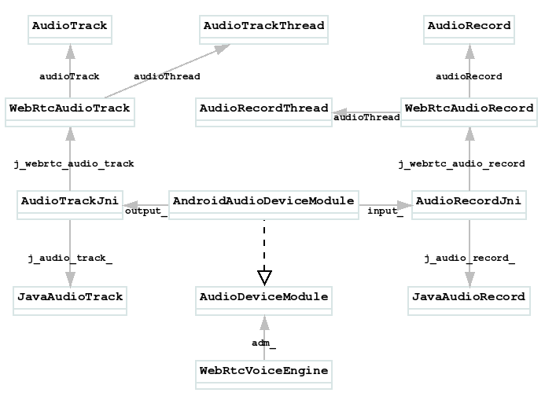

# JavaAudioDeviceModule 与 AndroidAudioDeviceModule

## AudioDeviceModule(Java)的创建
该类由如下方法创建:
```
JavaAudioDeviceModule.builder(ContextUtils.getApplicationContext())
        .createAudioDeviceModule();
```
直接看`JavaAudioDeviceModule.Builder.createAudioDeviceModule()`:
```
public AudioDeviceModule createAudioDeviceModule() {
    ...
    final WebRtcAudioRecord audioInput = new WebRtcAudioRecord(context, audioManager, audioSource,
        audioFormat, audioRecordErrorCallback, audioRecordStateCallback, samplesReadyCallback,
        useHardwareAcousticEchoCanceler, useHardwareNoiseSuppressor);
    final WebRtcAudioTrack audioOutput = new WebRtcAudioTrack(
        context, audioManager, audioTrackErrorCallback, audioTrackStateCallback);
    return new JavaAudioDeviceModule(context, audioManager, audioInput, audioOutput,
        inputSampleRate, outputSampleRate, useStereoInput, useStereoOutput);
}
```
可以看到两个音频相关的类:
* WebRtcAudioRecord
    sdk/android/src/java/org/webrtc/audio/WebRtcAudioRecord.java
* WebRtcAudioTrack
    sdk/android/src/java/org/webrtc/audio/WebRtcAudioTrack.java

对于WebRtcAudioRecord.java, 其通过audioRecord成员引用了AudioRecord:
```
private @Nullable AudioRecord audioRecord;
```
在其`initRecording()`方法中根据SDK的版本进行了区分, 但无论那种方式, 最终都是创建了AudioRecord对象:
```
if (Build.VERSION.SDK_INT >= Build.VERSION_CODES.M) {
    // Use the AudioRecord.Builder class on Android M (23) and above.
    // Throws IllegalArgumentException.   n  
    audioRecord = createAudioRecordOnMOrHigher(
        audioSource, sampleRate, channelConfig, audioFormat, bufferSizeInBytes);
    if (preferredDevice != null) {
        setPreferredDevice(preferredDevice);
    }
} else {
    // Use the old AudioRecord constructor for API levels below 23.
    // Throws UnsupportedOperationException.
    audioRecord = createAudioRecordOnLowerThanM(
        audioSource, sampleRate, channelConfig, audioFormat, bufferSizeInBytes);
}
```
在`JavaAudioDeviceModule`的创建中, 只是记录了`WebRtcAudioRecord`到`JavaAudioDeviceModule.audioInput`而已, 并没有做实际的初始化.那么`initRecording()`何时被调用的呢? 其是在`JavaAudioRecord::InitRecording()`中被调用的, 那么`JavaAudioRecord`又是什么? 其实它是在创建`AudioRecordJni`时创建的, 这要从PeerConnectionFactory.Builder.createPeerConnectionFactory()方法说起, 该方法中:
```
public PeerConnectionFactory createPeerConnectionFactory() {
    ...
    return nativeCreatePeerConnectionFactory(ContextUtils.getApplicationContext(), options,
          audioDeviceModule.getNativeAudioDeviceModulePointer(),
          ...
    );
}
```

查看JavaAudioDeviceModule.getNativeAudioDeviceModulePointer():
```
@Override
public long getNativeAudioDeviceModulePointer() {
    synchronized (nativeLock) {
        if (nativeAudioDeviceModule == 0) {
        nativeAudioDeviceModule = nativeCreateAudioDeviceModule(context, audioManager, audioInput,
            audioOutput, inputSampleRate, outputSampleRate, useStereoInput, useStereoOutput);
        }
        return nativeAudioDeviceModule;
    }
}
```
查看native方法:
```
JNI_GENERATOR_EXPORT jlong
    Java_org_webrtc_audio_JavaAudioDeviceModule_nativeCreateAudioDeviceModule(...){
        return JNI_JavaAudioDeviceModule_CreateAudioDeviceModule(env,
            base::android::JavaParamRef<jobject>(env, context), base::android::JavaParamRef<jobject>(env,
            audioManager), base::android::JavaParamRef<jobject>(env, audioInput),
            base::android::JavaParamRef<jobject>(env, audioOutput), inputSampleRate, outputSampleRate,
            useStereoInput, useStereoOutput
    }
```

继续查看`JNI_JavaAudioDeviceModule_CreateAudioDeviceModule()`方法:
```
static jlong JNI_JavaAudioDeviceModule_CreateAudioDeviceModule(...){
    auto audio_input = std::make_unique<AudioRecordJni>(
                            env, input_parameters, kHighLatencyModeDelayEstimateInMilliseconds,
                            j_webrtc_audio_record);
    auto audio_output = std::make_unique<AudioTrackJni>(env, output_parameters,
                            j_webrtc_audio_track);
    return jlongFromPointer(CreateAudioDeviceModuleFromInputAndOutput(
                            AudioDeviceModule::kAndroidJavaAudio,
                            j_use_stereo_input, j_use_stereo_output,
                            kHighLatencyModeDelayEstimateInMilliseconds,
                            std::move(audio_input), std::move(audio_output))
                            .release());
}
```
创建了`AudioTrackJni`对象, 并通过`j_webrtc_audio_record`关联到了`JavaAudioDeviceModule.audioInput`所对应的`WebRtcAudioRecord`类
看下`AudioRecordJni`的构造函数:
````
AudioRecordJni::AudioRecordJni(AudioManager* audio_manager)...{
    j_audio_record_.reset(
        new JavaAudioRecord(j_native_registration_.get(),
                            j_native_registration_->NewObject(
                                "<init>", "(J)V", PointerTojlong(this))));
    ...
}
````

继续查看`CreateAudioDeviceModuleFromInputAndOutput()`方法:
```
rtc::scoped_refptr<AudioDeviceModule> CreateAudioDeviceModuleFromInputAndOutput(...){
    return new rtc::RefCountedObject<AndroidAudioDeviceModule>(
        audio_layer, is_stereo_playout_supported, is_stereo_record_supported,
        playout_delay_ms, std::move(audio_input), std::move(audio_output));
}
```
创建了`AndroidAudioDeviceModule(AudioDeviceModule)`对象

这样其实`AudioRecordJni`就被设置给了`AndroidAudioDeviceModule(AudioDeviceModule)`的`input_`成员了
```
const std::unique_ptr<AudioInput> input_;
```

而WebRTC的Native真正需要的是AudioDeviceModule这个类. 对于`WebRtcAudioTrack`也是类似的情形. 那么`AudioDeviceModule`最后会关联到那个Native类中呢? 是下面这个:
```
// media/engine/webrtc_voice_engine.h
class WebRtcVoiceEngine final : public VoiceEngineInterface {
    ...
    rtc::scoped_refptr<webrtc::AudioDeviceModule> adm_;
    ...
}
```

基本类图如下:  
