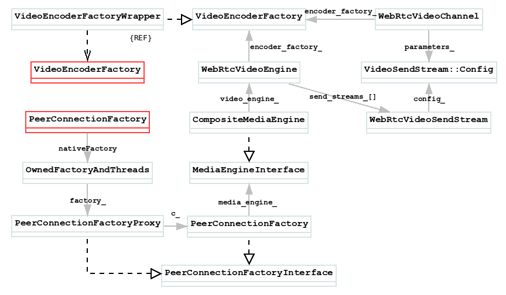
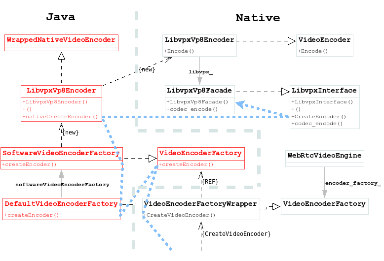

# VideoEncoderFactory

对于`VideoEncoderFactory`接口(Java层), 通常的实现是:`DefaultVideoEncoderFactory`.

`VideoEncoderFactory`是从外部设置进来的:
```
public class PeerConnectionFactory {
    ...
    public static class Builder {
        public Builder setVideoEncoderFactory(VideoEncoderFactory videoEncoderFactory) {
            this.videoEncoderFactory = videoEncoderFactory;
            return this;
        }
    }
    ...
}
```

然后在如下函数中使用:
```
public class PeerConnectionFactory {
    ...
    public static class Builder {
        ...
        public PeerConnectionFactory createPeerConnectionFactory() {
        ...
        return nativeCreatePeerConnectionFactory(ContextUtils.getApplicationContext(), options,
            ...
            audioDecoderFactoryFactory.createNativeAudioDecoderFactory(), videoEncoderFactory,
            ...
            neteqFactoryFactory == null ? 0 : neteqFactoryFactory.createNativeNetEqFactory());
        }
    }
    ...
}
```

那么`PeerConnectionFactory.Buider.nativeCreatePeerConnectionFactory()`对`VideoEncoderFactory`的使用:
```
JNI_GENERATOR_EXPORT jobject
        Java_org_webrtc_PeerConnectionFactory_nativeCreatePeerConnectionFactory(...){
    return JNI_PeerConnectionFactory_CreatePeerConnectionFactory(env,
        ...
        base::android::JavaParamRef<jobject>(env, encoderFactory),
        ...
        nativeNetworkStatePredictorFactory, neteqFactory).Release();
}
```

名字有点长:
```
static ScopedJavaLocalRef<jobject>
        JNI_PeerConnectionFactory_CreatePeerConnectionFactory(...){
    return CreatePeerConnectionFactoryForJava(
        ...
        jencoder_factory, jdecoder_factory,
        ...
        TakeOwnershipOfUniquePtr<NetEqFactory>(native_neteq_factory));
}
```

继续:
```
ScopedJavaLocalRef<jobject> CreatePeerConnectionFactoryForJava(...){
    media_dependencies.video_encoder_factory =
        absl::WrapUnique(CreateVideoEncoderFactory(jni, jencoder_factory));
    ...
    dependencies.media_engine = 
        cricket::CreateMediaEngine(std::move(media_dependencies));
    rtc::scoped_refptr<PeerConnectionFactoryInterface> factory =
        CreateModularPeerConnectionFactory(std::move(dependencies));
    return NativeToScopedJavaPeerConnectionFactory(
        jni, factory, std::move(network_thread), std::move(worker_thread),
        std::move(signaling_thread), network_monitor_factory);
}
```

先看`CreateVideoEncoderFactory()`:
```
VideoEncoderFactory* CreateVideoEncoderFactory(
    JNIEnv* jni,
    const JavaRef<jobject>& j_encoder_factory) {
  return IsNull(jni, j_encoder_factory)
             ? nullptr
             : new VideoEncoderFactoryWrapper(jni, j_encoder_factory);
}
```
继续`VideoEncoderFactoryWrapper`:
```
VideoEncoderFactoryWrapper::VideoEncoderFactoryWrapper(
    JNIEnv* jni,
    const JavaRef<jobject>& encoder_factory)
    : encoder_factory_(jni, encoder_factory) {
  const ScopedJavaLocalRef<jobjectArray> j_supported_codecs =
      Java_VideoEncoderFactory_getSupportedCodecs(jni, encoder_factory);
  supported_formats_ = JavaToNativeVector<SdpVideoFormat>(
      jni, j_supported_codecs, &VideoCodecInfoToSdpVideoFormat);
  const ScopedJavaLocalRef<jobjectArray> j_implementations =
      Java_VideoEncoderFactory_getImplementations(jni, encoder_factory);
  implementations_ = JavaToNativeVector<SdpVideoFormat>(
      jni, j_implementations, &VideoCodecInfoToSdpVideoFormat);
}
```
`VideoEncoderFactoryWrapper`是继承`VideoEncoderFactory`接口的, 创建后通过其引用Java层的`VideoEncoderFactory`

再看`CreateModularPeerConnectionFactory()`:
```
rtc::scoped_refptr<PeerConnectionFactoryInterface>
CreateModularPeerConnectionFactory(...){
    rtc::scoped_refptr<PeerConnectionFactory> pc_factory(
            new rtc::RefCountedObject<PeerConnectionFactory>(
                std::move(dependencies)));
    MethodCall<PeerConnectionFactory, bool> call(
            pc_factory.get(), &PeerConnectionFactory::Initialize);
    bool result = call.Marshal(RTC_FROM_HERE, pc_factory->signaling_thread());
    ...
    return PeerConnectionFactoryProxy::Create(pc_factory->signaling_thread(), pc_factory);
}
```

创建了`PeerConnectionFactory`, 先看构造函数:
```
PeerConnectionFactory::PeerConnectionFactory(
    PeerConnectionFactoryDependencies dependencies)
    : wraps_current_thread_(false),
    ...
    media_engine_(std::move(dependencies.media_engine)),
    trials_(dependencies.trials ? std::move(dependencies.trials)
                                  : std::make_unique<FieldTrialBasedConfig>()) {
        ...
    }
```
只是把`cricket::CreateMediaEngine(std::move(media_dependencies))`创建的`MediaEngineInterface`设置给了`PeerConnectionFactory`的`media_engine_`, 那还要看`CreateMediaEngine()`过程才能知道`VideoEncoderFactoryWrapper{VideoEncoderFactory}`最终设置给了谁:
```
std::unique_ptr<MediaEngineInterface> CreateMediaEngine(
    MediaEngineDependencies dependencies) {
        ...
        auto video_engine = std::make_unique<WebRtcVideoEngine>(
            std::move(dependencies.video_encoder_factory),
            std::move(dependencies.video_decoder_factory));
        ...
        return std::make_unique<CompositeMediaEngine>(std::move(audio_engine),
                std::move(video_engine));
```
创建了`WebRtcVideoEngine{MediaEngineInterface}`对象, 并将`VideoEncoderFactoryWrapper{VideoEncoderFactory}`设置到`WebRtcVideoEngine`的`encoder_factory_`中了


那个`PeerConnectionFactoryProxy`又是干什么的呢? 先看一组宏定义:
```
// api/proxy.h

#define PROXY_MAP_BOILERPLATE(c)                          \
  template <class PeerConnectionFactory>                         \
  class c##ProxyWithInternal;                             \
  typedef c##ProxyWithInternal<c##Interface> c##Proxy;    \
  template <class PeerConnectionFactory>                         \
  class c##ProxyWithInternal : public c##Interface {      \
   protected:                                             \
    typedef c##Interface C;                               \
                                                          \
   public:                                                \
    const PeerConnectionFactory* internal() const { return c_; } \
    PeerConnectionFactory* internal() { return c_; }

#define SIGNALING_PROXY_MAP_BOILERPLATE(c)                               \
 protected:                                                              \
  c##ProxyWithInternal(rtc::Thread* signaling_thread, PeerConnectionFactory* c) \
      : signaling_thread_(signaling_thread), c_(c) {}                    \
                                                                         \
 private:                                                                \
  mutable rtc::Thread* signaling_thread_;

#define REFCOUNTED_PROXY_MAP_BOILERPLATE(c)            \
 protected:                                            \
  ~c##ProxyWithInternal() {                            \
    MethodCall<c##ProxyWithInternal, void> call(       \
        this, &c##ProxyWithInternal::DestroyInternal); \
    call.Marshal(RTC_FROM_HERE, destructor_thread());  \
  }                                                    \
                                                       \
 private:                                              \
  void DestroyInternal() { c_ = nullptr; }             \
  rtc::scoped_refptr<PeerConnectionFactory> c_;

#define BEGIN_SIGNALING_PROXY_MAP(c)                                         \
  PROXY_MAP_BOILERPLATE(c)                                                   \
  SIGNALING_PROXY_MAP_BOILERPLATE(c)                                         \
  REFCOUNTED_PROXY_MAP_BOILERPLATE(c)                                        \
 public:                                                                     \
  static rtc::scoped_refptr<c##ProxyWithInternal> Create(                    \
      rtc::Thread* signaling_thread, PeerConnectionFactory* c) {                    \
    return new rtc::RefCountedObject<c##ProxyWithInternal>(signaling_thread, \
                                                           c);               \
  }
```

然后在文件`api/peer_connection_factory_proxy.h`中:
```
namespace webrtc {

// TODO(deadbeef): Move this to .cc file and out of api/. What threads methods
// are called on is an implementation detail.
BEGIN_SIGNALING_PROXY_MAP(PeerConnectionFactory)
...
}
```

简单展开`BEGIN_SIGNALING_PROXY_MAP(PeerConnectionFactory)`:
```
template <class PeerConnectionFactory>
class PeerConnectionFactoryProxyWithInternal;
typedef PeerConnectionFactoryProxyWithInternal<PeerConnectionFactoryInterface> PeerConnectionFactoryProxy;
template <class PeerConnectionFactory>
class PeerConnectionFactoryProxy : public c##Interface {
    public:
        const PeerConnectionFactory* internal() const { return c_; }
        PeerConnectionFactory* internal() { return c_; }
        static rtc::scoped_refptr<PeerConnectionFactoryProxy> Create(
            rtc::Thread* signaling_thread, PeerConnectionFactory* c) {
            return new rtc::RefCountedObject<PeerConnectionFactoryProxy>(signaling_thread, c);
        }
    protected:
        typedef PeerConnectionFactoryInterface C;
        PeerConnectionFactoryProxy(rtc::Thread* signaling_thread, PeerConnectionFactory* c)
            : signaling_thread_(signaling_thread), c_(c) {}
        ~PeerConnectionFactoryProxy() {
            MethodCall<PeerConnectionFactoryProxy, void> call(
                this, &PeerConnectionFactoryProxy::DestroyInternal);
            call.Marshal(RTC_FROM_HERE, destructor_thread());
        }
    private:
        mutable rtc::Thread* signaling_thread_;
        void DestroyInternal() { c_ = nullptr; }
        rtc::scoped_refptr<PeerConnectionFactory> c_;
}
```

可以看到得到的是继承自`PeerConnectionFactoryInterface`的`PeerConnectionFactoryProxy`, 其实`PeerConnectionFactory`也是继承自`PeerConnectionFactoryInterface`的, 但是它被`PeerConnectionFactoryProxy`代理了, 这意味着除了`Create()`, 所有对`PeerConnectionFactoryProxy`的调用都是对`PeerConnectionFactory`的调用, 因此继续上文的`PeerConnectionFactoryProxy::Create()`实际上是创建了一个`PeerConnectionFactoryProxy{PeerConnectionFactoryInterface}`并返回了.

最后看下`NativeToScopedJavaPeerConnectionFactory()`:
```
ScopedJavaLocalRef<jobject> NativeToScopedJavaPeerConnectionFactory(...){
    OwnedFactoryAndThreads* owned_factory = new OwnedFactoryAndThreads(
        std::move(network_thread), std::move(worker_thread),
        std::move(signaling_thread), network_monitor_factory, pcf);
    ScopedJavaLocalRef<jobject> j_pcf = Java_PeerConnectionFactory_Constructor(
        env, NativeToJavaPointer(owned_factory));
    ...
    return j_pcf;
}
```

可以清楚的看到`PeerConnectionFactoryProxy`被设设置到了`OwnedFactoryAndThreads`中的`factory_`, 最后创建Java层的`PeerConnectionFactory`, 并将`OwnedFactoryAndThreads`设置到其`nativeFactory`中. 

类的关系图:  



## DefaultVideoEncoderFactory创建LibvpxVp8Encoder
从`DefaultVideoEncoderFactory.createEncoder()`开始
```
public class DefaultVideoEncoderFactory implements VideoEncoderFactory {
    ...
    @Nullable
    @Override
    public VideoEncoder createEncoder(VideoCodecInfo info) {
        final VideoEncoder softwareEncoder = softwareVideoEncoderFactory.createEncoder(info);
        final VideoEncoder hardwareEncoder = hardwareVideoEncoderFactory.createEncoder(info);
        if (hardwareEncoder != null && softwareEncoder != null) {
            // Both hardware and software supported, wrap it in a software fallback
            return new VideoEncoderFallback(
                /* fallback= */ softwareEncoder, /* primary= */ hardwareEncoder);
        }
        return hardwareEncoder != null ? hardwareEncoder : softwareEncoder;
    }
    ...
}
```

引出两个EncoderFactory: `SoftwareVideoEncoderFactory`和`HardwareVideoEncoderFactory`, 先看`SoftwareVideoEncoderFactory`:
```
public class SoftwareVideoEncoderFactory implements VideoEncoderFactory {
    @Nullable
    @Override
    public VideoEncoder createEncoder(VideoCodecInfo info) {
        if (info.name.equalsIgnoreCase("VP8")) {
            return new LibvpxVp8Encoder();
        }
        if (info.name.equalsIgnoreCase("VP9") && LibvpxVp9Encoder.nativeIsSupported()) {
            return new LibvpxVp9Encoder();
        }
        return null;
    }
    ...
}
```

`LibvpxVp8Encoder`是实际解码的类么? 还是仅仅只是一个Java层的引用? 
```
public class LibvpxVp8Encoder extends WrappedNativeVideoEncoder {
  @Override
  public long createNativeVideoEncoder() {
    return nativeCreateEncoder();
  }

  static native long nativeCreateEncoder();

  @Override
  public boolean isHardwareEncoder() {
    return false;
  }
}
```

是一个引用, 那么它什么时候被调用? 其实实在`VideoEncoderFactoryWrapper::CreateVideoEncoder()`中从Native调用到Java的
```
std::unique_ptr<VideoEncoder> VideoEncoderFactoryWrapper::CreateVideoEncoder(...){
    ...
    ScopedJavaLocalRef<jobject> j_codec_info =
            SdpVideoFormatToVideoCodecInfo(jni, format);
    ScopedJavaLocalRef<jobject> encoder = Java_VideoEncoderFactory_createEncoder(
            jni, encoder_factory_, j_codec_info);
    ...
    return JavaToNativeVideoEncoder(jni, encoder);
}
```
首先通过`Java_VideoEncoderFactory_createEncoder)`创建了一个java层的Encoder, 然后将Java层的解码器转换成Native层的Encoder, 最后创建实际供使用的`VideoEncoderWrapper`. `Java_VideoEncoderFactory_createEncoder()`实际上就是`DefaultVideoEncoderFactory.createEncoder()`, 上文已经说过, 它将返回一个Java层的`LibvpxVp8Encoder`, 所以这里的`encoder`就是`LibvpxVp8Encoder`对应的`jobject`了.

继续看`JavaToNativeVideoEncoder()`:
```
std::unique_ptr<VideoEncoder> JavaToNativeVideoEncoder(...){
    const jlong native_encoder =
            Java_VideoEncoder_createNativeVideoEncoder(jni, j_encoder);
    VideoEncoder* encoder;
    if (native_encoder == 0) {
        encoder = new VideoEncoderWrapper(jni, j_encoder);
    } else {
        encoder = reinterpret_cast<VideoEncoder*>(native_encoder);
    }
    return std::unique_ptr<VideoEncoder>(encoder);
}
```

`Java_VideoEncoder_createNativeVideoEncoder`实际上就是`LibvpxVp8Encoder.createNativeVideoEncoder()`, 调用Java层的初始化接口, 去初始化`LibvpxVp8Encoder`
的Native层, 由上文进一步调用到:
```
JNI_GENERATOR_EXPORT jlong Java_org_webrtc_LibvpxVp8Encoder_nativeCreateEncoder(
    JNIEnv* env,
    jclass jcaller) {
  return JNI_LibvpxVp8Encoder_CreateEncoder(env);
}
```

继续看JNI:
```
static jlong JNI_LibvpxVp8Encoder_CreateEncoder(JNIEnv* jni) {
  return jlongFromPointer(VP8Encoder::Create().release());
}
```

`VP8Encoder::Create()`明显是创建了一个解码器:
```
std::unique_ptr<VideoEncoder> VP8Encoder::Create() {
  return std::make_unique<LibvpxVp8Encoder>(LibvpxInterface::CreateEncoder(),
                                            VP8Encoder::Settings());
}
```

先看下`LibvpxInterface::CreateEncoder()`这个接口, 它返回一个`LibvpxVp8Facade{LibvpxInterface}`, 用来构造`LibvpxVp8Encoder`:
```
std::unique_ptr<LibvpxInterface> LibvpxInterface::CreateEncoder() {
  return std::make_unique<LibvpxVp8Facade>();
}
```

`LibvpxVp8Facade`实现了`LibvpxInterface`接口, 那么`LibvpxInterface`接口的定义:
```
class LibvpxInterface {
    ...
    virtual vpx_codec_err_t codec_encode(vpx_codec_ctx_t* ctx,
            const vpx_image_t* img,
            vpx_codec_pts_t pts,
            uint64_t duration,
            vpx_enc_frame_flags_t flags,
            uint64_t deadline) const = 0;
    ...
}
```

接着看`LibvpxVp8Encoder`的构造:
```
LibvpxVp8Encoder::LibvpxVp8Encoder(std::unique_ptr<LibvpxInterface> interface,
                                   VP8Encoder::Settings settings)
    : libvpx_(std::move(interface)),
    ...
    framerate_controller_(variable_framerate_experiment_.framerate_limit) {
}
```

最后调用`LibvpxVp8Encoder::Encode()`时
```
int LibvpxVp8Encoder::Encode(const VideoFrame& frame,
        const std::vector<VideoFrameType>* frame_types) {
    ...
    while (num_tries == 0 ||
            (num_tries == 1 &&
            error == WEBRTC_VIDEO_CODEC_TARGET_BITRATE_OVERSHOOT)) {
        ...
        error = libvpx_->codec_encode(&encoders_[0], &raw_images_[0], timestamp_,
                duration, 0, VPX_DL_REALTIME);
    }
    ...
}
```

最后`LibvpxVp8Encoder`本身被`VideoEncoderFactoryWrapper::CreateVideoEncoder()`返回了, 此时类图关系如下:  
