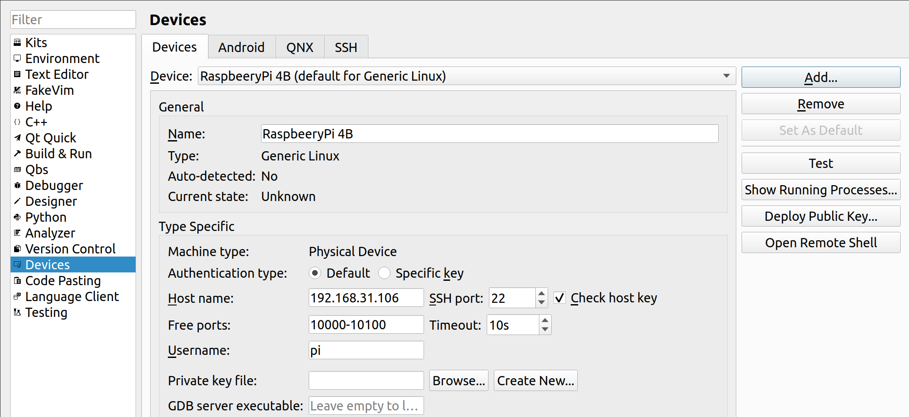

# Qt on RaspberryPi 4B

## 配置树莓派
登录
```
nickli@Earth:~$ ssh pi@192.168.31.106
pi@raspberrypi:~ $ sudo raspi-config
```
* 选择"2 Network Options      Configure network settings"
* 选择"N2 Wi-fi                   Enter SSID and passphrase"
* 在"Please enter SSID"中输入: <**SSID, 即WiFi名**>(例如: "TP-LINK_6606")
* 在"Please enter passphrase. Leave it empty if none."中输入:**<路由器的密码**>

更新树莓派的源(参考: http://mirrors.ustc.edu.cn/help/raspberrypi.html):
```
pi@raspberrypi:~ $ sudo sed -i 's|//archive.raspberrypi.org|//mirrors.ustc.edu.cn/archive.raspberrypi.org|g' /etc/apt/sources.list.d/raspi.list
pi@raspberrypi:~ $ sudo apt-get update
...
已下载 13.6 MB，耗时 12秒 (1,099 kB/s)                                                                                                                                                                                          
正在读取软件包列表... 完成
```

安装开发包:
```
pi@raspberrypi:~ $ sudo apt-get install -y qt5-qmake
pi@raspberrypi:~ $ sudo apt-get install -y libqt5gui5
pi@raspberrypi:~ $ sudo apt-get install -y libqt5webengine-data
pi@raspberrypi:~ $ sudo apt-get install -y libqt5webkit5
pi@raspberrypi:~ $ sudo apt-get install -y libudev-dev libinput-dev libts-dev libxcb-xinerama0-dev libxcb-xinerama0 gdbserver
```

安装多媒体包:
```
pi@raspberrypi:~ $ sudo apt-get install -y gstreamer1.0-plugins*
pi@raspberrypi:~ $ sudo apt-get install -y libgstreamer1.0-dev  libgstreamer-plugins-base1.0-dev libopenal-data libsndio7.0 libopenal1 libopenal-dev pulseaudio
pi@raspberrypi:~ $ sudo apt-get install -y bluez-tools
pi@raspberrypi:~ $ sudo apt-get install -y libbluetooth-dev
```

在树莓派上建立用于安装Qt的目录:
```
pi@raspberrypi:~ $ sudo mkdir /usr/local/qt5.15
pi@raspberrypi:~ $ sudo chown -R pi:pi /usr/local/qt5.15
```

## 配置PC(Ubuntu 20.04 LTS)

配置树莓派免密码登录:
```
pi@raspberrypi:~ $ ssh-keygen -t rsa -C liyangzmx@163.com
pi@raspberrypi:~ $ ssh-copy-id -i ~/.ssh/id_rsa.pub pi@192.168.31.106
<输入密码即可>
```

安装:
```
nickli@Earth:~$ sudo apt-get update
nickli@Earth:~$ sudo apt-get upgrade
nickli@Earth:~$ sudo apt-get install gcc git bison python gperf pkg-config gdb-multiarch
nickli@Earth:~$ sudo apt install build-essential
```

创建本地目录结构:
```
nickli@Earth:~$ sudo mkdir ~/rpi
nickli@Earth:~$ sudo mkdir ~/rpi/build
nickli@Earth:~$ sudo mkdir ~/rpi/tools
nickli@Earth:~$ sudo mkdir ~/rpi/sysroot
nickli@Earth:~$ sudo mkdir ~/rpi/sysroot/usr
nickli@Earth:~$ sudo mkdir ~/rpi/sysroot/opt
nickli@Earth:~$ sudo chown -R 1000:1000 ~/rpi
nickli@Earth:~$ cd ~/rpi
nickli@Earth:~/rpi$ 
```

下载Qt源码:
```
nickli@Earth:~/rpi$ wget https://mirrors.ustc.edu.cn/qtproject/archive/qt/5.15/5.15.2/single/qt-everywhere-src-5.15.2.tar.xz
nickli@Earth:~/rpi$ tar xvf qt-everywhere-src-5.15.2.tar.xz
```

做一些处理:
```
nickli@Earth:~/rpi$ cp -R qt-everywhere-src-5.15.2/qtbase/mkspecs/linux-arm-gnueabi-g++ qt-everywhere-src-5.15.2/qtbase/mkspecs/linux-arm-gnueabihf-g++
nickli@Earth:~/rpi$ sed -i -e 's/arm-linux-gnueabi-/arm-linux-gnueabihf-/g' qt-everywhere-src-5.15.2/qtbase/mkspecs/linux-arm-gnueabihf-g++/qmake.conf
```

下载工具链:
```
nickli@Earth:~/rpi$ mkdir -p ~/rpi/tools
nickli@Earth:~/rpi$ cd ~/rpi/tools
nickli@Earth:~/rpi/tools$ wget https://releases.linaro.org/components/toolchain/binaries/7.4-2019.02/arm-linux-gnueabihf/gcc-linaro-7.4.1-2019.02-x86_64_arm-linux-gnueabihf.tar.xz
nickli@Earth:~/rpi/tools$ tar xvf gcc-linaro-7.4.1-2019.02-x86_64_arm-linux-gnueabihf.tar.xz
```

同步树莓派的rootfs到本机:
```
nickli@Earth:~/rpi/tools$ cd ~/rpi/
nickli@Earth:~/rpi$ rsync -avz --rsync-path="sudo rsync" --delete pi@192.168.31.106:/lib sysroot

nickli@Earth:~/rpi$ rsync -avz --rsync-path="sudo rsync" --delete pi@192.168.31.106:/lib sysroot
nickli@Earth:~/rpi$ rsync -avz --rsync-path="sudo rsync" --delete pi@192.168.31.106:/usr/include sysroot/usr
nickli@Earth:~/rpi$ rsync -avz --rsync-path="sudo rsync" --delete pi@192.168.31.106:/usr/lib sysroot/usr
nickli@Earth:~/rpi$ rsync -avz --rsync-path="sudo rsync" --delete pi@192.168.31.106:/opt/vc sysroot/opt
nickli@Earth:~/rpi$ du -sh sysroot
3.6G	sysroot
```

修正sysroot下的符号链接错误:
```
nickli@Earth:~/rpi$ wget https://raw.githubusercontent.com/riscv/riscv-poky/master/scripts/sysroot-relativelinks.py
nickli@Earth:~/rpi$ chmod a+x sysroot-relativelinks.py
nickli@Earth:~/rpi$ ./sysroot-relativelinks.py sysroot
```

配置编译Qt:
```
nickli@Earth:~/rpi$ mkdir -p ~/rpi/build
nickli@Earth:~/rpi$ cd ~/rpi/build
nickli@Earth:~/rpi/build$ ../qt-everywhere-src-5.15.2/configure -release -opengl es2  -eglfs -device linux-rasp-pi4-v3d-g++ -device-option CROSS_COMPILE=~/rpi/tools/gcc-linaro-7.4.1-2019.02-x86_64_arm-linux-gnueabihf/bin/arm-linux-gnueabihf- -sysroot ~/rpi/sysroot -prefix /usr/local/qt5.15 -extprefix ~/rpi/qt5.15 -opensource -confirm-license -skip qtscript -skip qtwayland -skip qtwebengine -nomake tests -make libs -pkg-config -no-use-gold-linker -v -recheck
<等一会儿>
nickli@Earth:~/rpi/build$ make -j32
nickli@Earth:~/rpi$ du -sh build/
11G	build/
```

安装Qt到`~/rpi/qt5.15/`:
```
nickli@Earth:~/rpi/build$ make install
nickli@Earth:~/rpi/build$ cd ~/rpi/
nickli@Earth:~/rpi$ du -sh qt5.15/
216M	qt5.15/
```

同步`~/rpi/qt5.15/`到树莓派:
```
nickli@Earth:~/rpi$ rsync -avz --rsync-path="sudo rsync" qt5.15 pi@192.168.31.106:/usr/local
```

在树莓派上更新库:
```
pi@raspberrypi:~ $ echo /usr/local/qt5.15/lib | sudo tee /etc/ld.so.conf.d/qt5.15.conf
/usr/local/qt5.15/lib
pi@raspberrypi:~ $ sudo ldconfig
```

在PC上编译一个demo:
```
nickli@Earth:~/rpi$ cp -r ~/rpi/qt-everywhere-src-5.15.2/qtbase/examples/opengl/qopenglwidget ~/rpi/
nickli@Earth:~/rpi$ cd ~/rpi/qopenglwidget
nickli@Earth:~/rpi/qopenglwidget$ ../qt5.15/bin/qmake
Info: creating stash file /home/liyang/rpi/qopenglwidget/.qmake.stash
nickli@Earth:~/rpi/qopenglwidget$ make
```

推送PC上的demo到树莓派:
```
nickli@Earth:~/rpi/qopenglwidget$ scp qopenglwidget pi@192.168.31.106:/home/pi
```

在PC上安装VNCViewer, 从https://www.realvnc.com/en/connect/download/viewer/linux/ 下载VNCViewer  
或者直接下载: https://www.realvnc.com/download/file/viewer.files/VNC-Viewer-6.20.529-Linux-x64  
```
nickli@Earth:/download$ chmod a+x VNC-Viewer-6.20.529-Linux-x64
```
运行即可...

下载Qt安装包:
```
nickli@Earth:~/rpi$ wget http://download.qt.io/official_releases/qt/5.12/5.12.10/qt-opensource-linux-x64-5.12.10.run
nickli@Earth:~/rpi$ chmod a+x qt-opensource-linux-x64-5.12.10.run 
nickli@Earth:~/rpi$ ./qt-opensource-linux-x64-5.12.10.run
```
完成登录与安装.

配置Devices:
* 打开: "Tools" -> "Option.." -> "Devices" -> "Add"
* "Avaliable device types"选择"Generic Linux Device", 然后点击"Start Wizard"
* "The name to identify this configuration"填写"RaspberryPi 4B"就行
* "The device's host name or IP address:"填写树莓派的IP, 例如:"192.168.31.106"
* "The username to log into the device:"填写树莓派的用户名, 例如: "pi"
* "Private key file:"填写默认的"/home/liyang/.ssh/id_rsa.pub"就可以, 然后点击"Next", 然后点击"Finish"既可, 配置完成如下:


配置编译器:
* 打开: "Tools" -> "Option.." -> "Kits" -> "Compilers"
* 依次点击"Add" -> "GCC" -> "C"
* 填写如下:
  * "Name": "Raspberrypi GCC"
  * "Compiler Path": "/home/liyang/rpi/tools/gcc-linaro-7.4.1-2019.02-x86_64_arm-linux-gnueabihf/bin/arm-linux-gnueabihf-gcc"
  * "Platform codegen flags": ""
  * "Paltform linker flags": ""
  * "ABI": "arm-linux-generic-elf-32bit"
* 依次点击"Add" -> "GCC" -> "C++"
* 填写如下:
  * "Name": "Raspberrypi G++"
  * "Compiler Path": "/home/liyang/rpi/tools/gcc-linaro-7.4.1-2019.02-x86_64_arm-linux-gnueabihf/bin/arm-linux-gnueabihf-g++"
  * "Platform codegen flags": ""
  * "Paltform linker flags": ""
  * "ABI": "arm-linux-generic-elf-32bit"

配置Qt版本:
* 打开"Tools" -> "Option.." -> "Kits" -> "Qt Versions"
* 依次点击"Add" -> 选择上面编译好的: "~/rpi/qt5.15/bin/qmake"
* "Version name": 自动设置为: "Qt %{Qt:Version} (qt5.15)"

配置Kits:
* 打开"Tools" -> "Option.." -> "Kits" -> "Kits"
* 点击"Add"添加一个Kits, 然后配置:
  * "Name": "Raspberrypi QKit"
  * "File system name": ""
  * "Device type": "Generic Linux Device"
  * "Device": 选择刚才新建的"RaspberryPi 4B(Generic Linux Device)"
  * "Sysroot": 选择此前同步到PC的树莓派文件系统: "/home/liyang/rpi/sysroot"
  * "Compiler"
    * "C":选择前面新建的C Compiler:"Raspberrypi GCC"
    * "C++":选择前面新建的C++ Compiler:"Raspberrypi G++"
  * "Evironement": 默认的"No changes to apply."
  * "Debugger": "System GDB at /usr/bin/gdb"
  * "Qt version": 选择此前新建的Qt Version: "Qt 5.15.2(qt5.15)"
  * "Qt mkspec": ""
  * "Additional Qbs Profile Settings": ""
  * "CMake Tool": "System CMake at /usr/bin/cmake"
  * 其余默认即可.

遇到运行错误:
```
21:52:54: Starting /usr/local/qt5.15/examples/gui/analogclock/analogclock ...
qt.qpa.egldeviceintegration: Failed to load EGL device integration "eglfs_kms"
Could not initialize egl display
21:52:54: Remote process crashed.
```