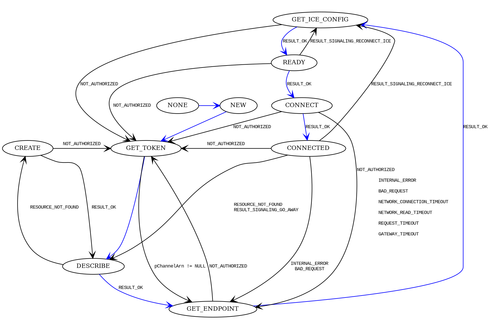

# Graphviz

例子:

```graphviz
digraph StateMachine {
    graph [style = rounded, splines = true, rankdep = 10, ranksep = .5, compound = true]
    node [colorscheme=spectral7, style = filled, fillcolor = white, fontsize = 10, height=.3]
    edge [fontsize = 8, fontname = "Courier New", arrowhead = vee]
    rankdir = TB
    CREATE
    subgraph cluster_A {
        style = invis
        {rank = same; NONE; NEW}
        GET_TOKEN
        DESCRIBE
        GET_ENDPOINT
    }
    subgraph cluster_B {
        style = invis
        GET_ICE_CONFIG
        READY
        CONNECT
        CONNECTED
    }
    NONE -> NEW [color=blue]
    NEW -> GET_TOKEN [color=blue]
    GET_TOKEN->DESCRIBE [color=blue]
    rankdir = TB
    CREATE -> GET_TOKEN [label = "NOT_AUTHORIZED"]
    DESCRIBE -> CREATE [label = "RESOURCE_NOT_FOUND"]
    CREATE -> DESCRIBE [label = "RESULT_OK"]
    DESCRIBE -> GET_ENDPOINT [label = "RESULT_OK", color=blue]
    GET_ENDPOINT -> GET_ICE_CONFIG [label = "RESULT_OK", color=blue]
    GET_ICE_CONFIG -> READY [label = "RESULT_OK", color=blue]
    READY -> CONNECT [label = "RESULT_OK", color=blue]
    CONNECT -> CONNECTED [label = "RESULT_OK", color=blue]
    CONNECTED -> GET_TOKEN [label = "NOT_AUTHORIZED"]
    CONNECTED -> DESCRIBE [label = "RESOURCE_NOT_FOUND\lRESULT_SIGNALING_GO_AWAY"]
    CONNECTED -> GET_ENDPOINT [label = "INTERNAL_ERROR\lBAD_REQUEST"]
    CONNECTED -> GET_ICE_CONFIG [label = "RESULT_SIGNALING_RECONNECT_ICE"]
    CONNECT -> GET_TOKEN [label = "NOT_AUTHORIZED"]
    CONNECT -> GET_ENDPOINT [label = "NOT_AUTHORIZED\l
        INTERNAL_ERROR\l
        BAD_REQUEST\l
        NETWORK_CONNECTION_TIMEOUT\l
        NETWORK_READ_TIMEOUT\l
        REQUEST_TIMEOUT\l
        GATEWAY_TIMEOUT\l
        "]
    rankdir = TB
    READY -> GET_TOKEN [label = "NOT_AUTHORIZED"]
    READY -> GET_ICE_CONFIG [label = "RESULT_SIGNALING_RECONNECT_ICE"]
    GET_ICE_CONFIG -> GET_TOKEN [label = "NOT_AUTHORIZED"]
    GET_TOKEN -> GET_ENDPOINT [label = "pChannelArn != NULL"]
    GET_ENDPOINT -> GET_TOKEN [label = "NOT_AUTHORIZED"]
}
```