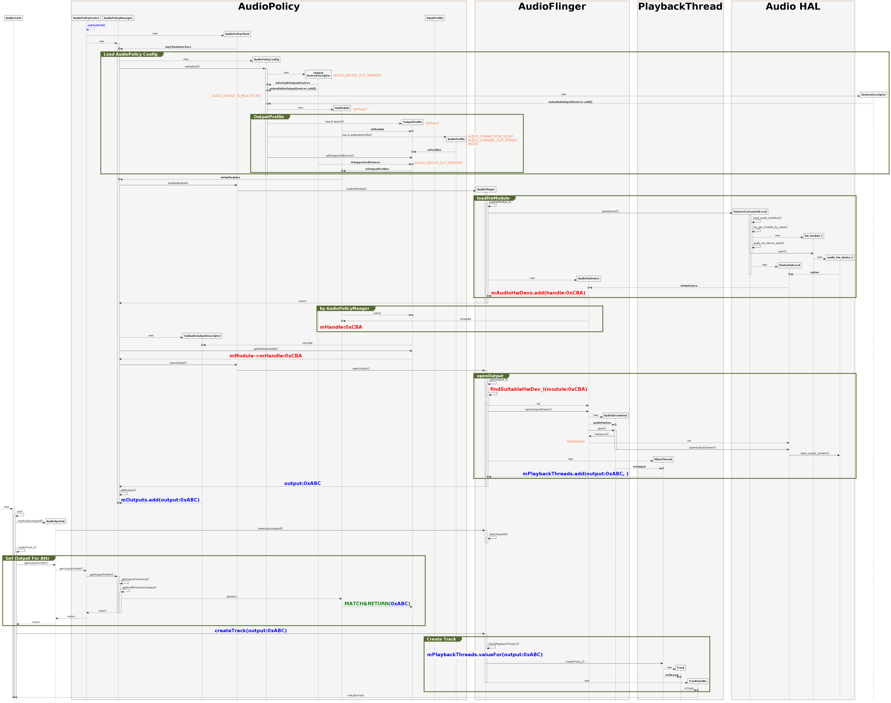

# VSCode+PlantUML插件绘制软件时序图demo

## 说明
以下参考源码未使用第三方库, 例如: plantuml-style-c4等.

本文仅针对时序图, 其他图形, 参考官方的文档即可.

Good Luck~

## 基本环境

VScode + PlantUML插件,

## Tips
* 源码文件名应为: *****.puml**
* 实时预览使用快捷键: **Alt+D**
* 到处png使用: **Ctrl+Shift+P**, 然后选择: "**PlantUML: Export current digram**" -> "**png**"即可
* ~~符号补全也推荐使用Tabnine插件~~

## 参考资料
时序图相关: [https://plantuml.com/zh/sequence-diagram](https://plantuml.com/zh/sequence-diagram)

皮肤参数相关: [all-skin-params](https://plantuml-documentation.readthedocs.io/en/latest/formatting/all-skin-params.html)

## PlantUML的尺寸限制问题
PlantUML对输出的图像大小有限制, 会导致很大的图不能以稍高的DPI完整输出, 这个问题需要在VScode的Settings.json里简单配置一下:  
```
"plantuml.commandArgs": [
         "-DPLANTUML_LIMIT_SIZE=81920"
],
```

## 图例


## 范例
```
@startuml MediaPlayer
 
hide footbox
skinparam {
    ' defaultFontName Abyssinica SIL
    Shadowing false  
    backgroundColor white
    NoteFontColor #OrangeRed
    NoteFontSize 16
    NoteTextAlignment left
    NoteBackgroundColor WhiteSmoke
    NoteColor transparent
    NoteBorderThickness 0
    NoteBorderColor transparent
    NoteBorderThickness 0
    NoteShadowing false
    ParticipantPadding 0
    BoxPadding 20
    dpi 96
    ClassBackgroundColor transparent
    ClassHeaderBackgroundColor lightgreen
    ClassStereotypeFontColor transparent
    SequenceBoxBordercolor sienna
    SequenceBoxFontSize 48
    SequenceBoxFontColor Black
    SequenceBoxBackgroundColor WhiteSmoke
    SequenceLifeLineBackgroundColor WhiteSmoke
    SequenceMessageAlignment center
    SequenceGroupHeaderFontColor White
    SequenceGroupHeaderFontSize 20
    SequenceGroupBackgroundColor DarkOliveGreen
    SequenceGroupBodyBackgroundColor transparent
    SequenceGroupBorderThickness 4
    SequenceGroupBorderColor DarkOliveGreen
    ' transparent
    sequence {
        ParticipantBackgroundColor WhiteSmoke
        ParticipantBorderColor Gray
        ParticipantFontStyle Bold
        ParticipantFontSize 12
        ParticipantPadding 0
 
        LifeLineBorderColor DimGray
        ArrowColor Black
        ArrowThickness 0.8
        ColorArrowSeparationSpace 30
    }
}
 
participant AudioTrack
 
participant AudioSystem
 
box AudioPolicy
participant AudioPolicyService
participant AudioPolicyManager
participant SwAudioOutputDescriptor
participant AudioPolicyClient
participant AudioPolicyConfig
participant "Output\nDeviceDescriptor" as DeviceDescriptor
' participant "Input\nDeviceDescriptor" as IDeviceDescriptor
participant HwModule
participant OutputProfile
participant InputProfile
participant AudioProfile
end box
box AudioFlinger
participant AudioFlinger
participant AudioHwDevice
participant AudioStreamOut
end box
box PlaybackThread
participant MixerThread
participant Track
participant TrackHandle
end box
box Audio HAL
participant DevicesFactoryHalLocal
participant DeviceHalLocal
participant hw_module_t
participant audio_hw_device_t
end box
AudioPolicyService-[#Blue]->AudioPolicyService:<color blue>**onFirstRef()**</color>
create AudioPolicyClient
AudioPolicyService-->AudioPolicyClient:new
AudioPolicyService-->AudioPolicyManager:new
activate AudioPolicyManager
AudioPolicyClient-->o AudioPolicyManager:**mpClientInterface**
group Load AudioPolicy Config
create AudioPolicyConfig
AudioPolicyManager-->AudioPolicyConfig:new
AudioPolicyManager->AudioPolicyConfig:setDefault()
activate AudioPolicyConfig
create DeviceDescriptor
AudioPolicyConfig-->DeviceDescriptor:new
note right:AUDIO_DEVICE_OUT_SPEAKER
DeviceDescriptor-->o AudioPolicyConfig:**mDefaultOutputDevices**
DeviceDescriptor-->o AudioPolicyConfig:**mAvailableOutputDevices.add()**
create IDeviceDescriptor
AudioPolicyConfig-->IDeviceDescriptor:new
note left:AUDIO_DEVICE_IN_BUILTIN_MIC
IDeviceDescriptor-->o AudioPolicyConfig:**mAvailableInputDevices.add()**
create HwModule
AudioPolicyConfig-->HwModule:new
note right:"primary"
group OutputProfile
create OutputProfile
AudioPolicyConfig-->OutputProfile:new & attach()
note right:"primary"
HwModule-->o OutputProfile:**mModule**
create AudioProfile
AudioPolicyConfig-->AudioProfile:new & addAudioProfile()
note right:AUDIO_FORMAT_PCM_16_BIT\nAUDIO_CHANNEL_OUT_STEREO\n44100
' AudioPolicyConfig->OutputProfile:addAudioProfile()
AudioProfile-->o OutputProfile:**mProfiles**
AudioPolicyConfig->OutputProfile:addSupportedDevice()
DeviceDescriptor-->o OutputProfile:**mSupportedDevices**
note right:AUDIO_DEVICE_OUT_SPEAKER
OutputProfile-->o HwModule:**mOutputProfiles**
end group
 
end group
deactivate AudioPolicyConfig
 
HwModule-->o AudioPolicyManager:**mHwModules**
 
 
 
 
AudioPolicyManager->AudioPolicyClient:loadHwModule()
create AudioFlinger
AudioPolicyClient->AudioFlinger:loadHwModule()
group loadHwModule
activate AudioFlinger
AudioFlinger->AudioFlinger:loadHwModule_l()
activate AudioFlinger
 
create DevicesFactoryHalLocal
 
AudioFlinger->DevicesFactoryHalLocal:openDevice()
activate DevicesFactoryHalLocal
DevicesFactoryHalLocal->DevicesFactoryHalLocal:load_audio_interface()
activate DevicesFactoryHalLocal
DevicesFactoryHalLocal->DevicesFactoryHalLocal:hw_get_module_by_class()
 
create hw_module_t
DevicesFactoryHalLocal-->hw_module_t:new
DevicesFactoryHalLocal->DevicesFactoryHalLocal:audio_hw_device_open()
DevicesFactoryHalLocal->hw_module_t:open()
deactivate DevicesFactoryHalLocal
create audio_hw_device_t
hw_module_t-->audio_hw_device_t:new
create DeviceHalLocal
DevicesFactoryHalLocal-->DeviceHalLocal:new
audio_hw_device_t-->o DeviceHalLocal:**mDev**
deactivate DevicesFactoryHalLocal
 
create AudioHwDevice
AudioFlinger-->AudioHwDevice:new
DeviceHalLocal-->o AudioHwDevice:**mHwDevice**
AudioHwDevice-->o AudioFlinger:<font size=24><color red>**mAudioHwDevs.add(handle:0xCBA)**</color></font>
end group
 
AudioFlinger-->AudioPolicyManager:return
deactivate AudioFlinger
deactivate AudioFlinger
 
 
group by AudioPolicyManger
HwModule-->o OutputProfile:mPort
AudioHwDevice-->o HwModule:mHandle
note over HwModule:<font size=24><color red>**mHandle:0xCBA**</color></font>
end group
 
create SwAudioOutputDescriptor
AudioPolicyManager-->SwAudioOutputDescriptor:new
OutputProfile-->o SwAudioOutputDescriptor:mProfile
 
AudioPolicyManager->OutputProfile:getModuleHandle()
OutputProfile-->AudioPolicyManager:<font size=24><color red>**mModule->mHandle:0xCBA**</color></font>
 
AudioPolicyManager->AudioPolicyClient:openOutput()
AudioPolicyClient->AudioFlinger:openOutput()
group openOutput
activate AudioFlinger
AudioFlinger->AudioFlinger:openOutput_l()
activate AudioFlinger
AudioFlinger->AudioFlinger:<font size=24><color red>**findSuitableHwDev_l(module:0xCBA)**</color></font>
note over AudioFlinger:
activate AudioFlinger
AudioFlinger-->AudioHwDevice:ret
deactivate AudioFlinger
AudioFlinger->AudioHwDevice:openOutputStream()
 
create AudioStreamOut
AudioHwDevice-->AudioStreamOut:new
AudioHwDevice-->o AudioStreamOut:**audioHwDev**
AudioHwDevice->AudioStreamOut:open()
activate AudioStreamOut
AudioStreamOut->AudioHwDevice:hwDevice()
AudioHwDevice-->DeviceHalLocal:ret
note left:mHwDevice
AudioStreamOut->DeviceHalLocal:openOutputStream()
deactivate AudioStreamOut
DeviceHalLocal->audio_hw_device_t:open_output_stream()
create MixerThread
AudioFlinger-->MixerThread:new
AudioStreamOut-->o MixerThread:**mOutput**
 
MixerThread-->o AudioFlinger:<color blue><font size=24>**mPlaybackThreads.add(output:0xABC, )**</font></color>
end group
 
AudioFlinger-->AudioPolicyManager:<color blue><font size=24>**output:0xABC**</font></color>
deactivate AudioFlinger
deactivate AudioFlinger
 
AudioPolicyManager->AudioPolicyManager:addOutput()
SwAudioOutputDescriptor-->o AudioPolicyManager:<font size=24><color blue>**mOutputs.add(output:0xABC)**</color></font>
 
deactivate AudioPolicyManager
 
-->AudioTrack:new
activate AudioTrack
AudioTrack->AudioTrack:set()
activate AudioTrack
create AudioSystem
AudioTrack->AudioSystem:newAudioUniqueId()
AudioSystem->AudioFlinger:newAudioUniqueId()
activate AudioFlinger
AudioFlinger->AudioFlinger:nextUniqueId()
activate AudioFlinger
deactivate AudioFlinger
deactivate AudioFlinger
 
AudioTrack->AudioTrack:createTrack_l()
activate AudioTrack
 
group Get Output For Attr
AudioTrack->AudioSystem:getOutputForAttr()
AudioSystem-->AudioPolicyService:getOutputForAttr()
AudioPolicyService->AudioPolicyManager:getOutputForAttr()
activate AudioPolicyManager
 
AudioPolicyManager->AudioPolicyManager:getOutputForDevice()
activate AudioPolicyManager
AudioPolicyManager->AudioPolicyManager:getProfileForDirectOutput()
activate AudioPolicyManager
AudioPolicyManager-->HwModule:SEARCH
HwModule-->OutputProfile:\
<font size=24><color green>**MATCH&RETURN(**</color></font>\
<font size=24><color blue>**0xABC**</color></font>\
<font size=24><color green>**)**</color></font>
 
AudioPolicyManager-->AudioPolicyService:return
deactivate AudioPolicyManager
deactivate AudioPolicyManager
deactivate AudioPolicyManager
AudioPolicyService-->AudioSystem:return
AudioSystem-->AudioTrack:return
 
end group
 
AudioTrack->AudioFlinger:<color blue><font size=24>**createTrack(output:0xABC)**</font></color>
activate AudioFlinger
 
group Create Track
AudioFlinger->AudioFlinger:checkPlaybackThread_l()
note over AudioFlinger:<color blue><font size=24>**mPlaybackThreads.valueFor(output:0xABC)**</font></color>
 
AudioFlinger->MixerThread:createTrack_l()
create Track
MixerThread-->Track:new
MixerThread-->o Track:**mThread**
 
create TrackHandle
AudioFlinger-->TrackHandle:new
deactivate AudioFlinger
Track-->o TrackHandle:mTrack
end group
 
TrackHandle-->o AudioTrack:mAudioTrack
deactivate AudioTrack
deactivate AudioTrack
deactivate AudioTrack
 
@enduml
```