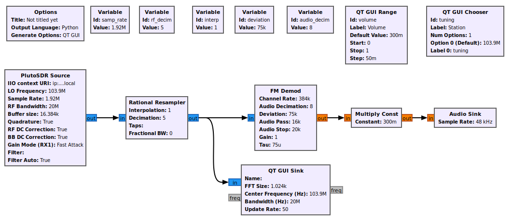

# GNURadio

## 参考资料
开发参考:  
[ADALM-PLUTO for Developers](https://wiki.analog.com/university/tools/pluto/developers)  

硬件参考:  
[Hacking the ADALM-PLUTO](https://wiki.analog.com/university/tools/pluto/hackers)

GNURadio参考:  
[GNU Radio and IIO Devices: gr-iio](https://wiki.analog.com/resources/tools-software/linux-software/gnuradio)  

关于启用70MHz:  
[Customizing the Pluto configuration](https://wiki.analog.com/university/tools/pluto/users/customizing)  

## GPURadio的安装
命令:
```
sudo apt install gnuradio-dev gnuradio gnuradio-doc 
sudo apt install libxml2 libxml2-dev bison flex cmake git libaio-dev libboost-all-dev
sudo apt install doxygen
sudo apt install libusb-1.0-0-dev
sudo apt install libavahi-common-dev libavahi-client-dev
mkdir -p /opt/gnuradio
cd /opt/gnuradio

git clone https://github.com/analogdevicesinc/libiio.git
cd libiio/
mkdir out
cd out/
cmake ..
make -j32
sudo make install
cd /opt/gnuradio

git clone https://github.com/analogdevicesinc/libad9361-iio.git
cd libad9361-iio
mkdir out
cd out/
cmake ..
make -j32
sudo make install

sudo apt install bison flex cmake git libgmp-dev
sudo apt install swig
cd /opt/gnuradio
git clone https://github.com/analogdevicesinc/gr-iio.git
cd gr-iio
mkdir out
cd out/
cmake ..
make -j32
```
make时遭遇报错:
```
/opt/gnuradio/gr-iio/lib/iio_math_gen_impl.cc:31:10: fatal error: gnuradio/analog/sig_source_f.h: No such file or directory
   31 | #include <gnuradio/analog/sig_source_f.h>
      |          ^~~~~~~~~~~~~~~~~~~~~~~~~~~~~~~~
compilation terminated.
make[2]: *** [lib/CMakeFiles/gnuradio-iio.dir/build.make:230: lib/CMakeFiles/gnuradio-iio.dir/iio_math_gen_impl.cc.o] Error 1
make[2]: *** Waiting for unfinished jobs....
/opt/gnuradio/gr-iio/lib/iio_math_impl.cc:30:10: fatal error: gnuradio/analog/sig_source_f.h: No such file or directory
   30 | #include <gnuradio/analog/sig_source_f.h>
      |          ^~~~~~~~~~~~~~~~~~~~~~~~~~~~~~~~
compilation terminated.
make[2]: *** [lib/CMakeFiles/gnuradio-iio.dir/build.make:217: lib/CMakeFiles/gnuradio-iio.dir/iio_math_impl.cc.o] Error 1
make[1]: *** [CMakeFiles/Makefile2:219: lib/CMakeFiles/gnuradio-iio.dir/all] Error 2
make: *** [Makefile:130: all] Error 2
```

特别的, 对于3.8.1的高版本GNURadio, 应注意gr-iio的分支, 因此解决方法:
```
cd /opt/gnuradio
rm -rf gr-iio/
git clone -b upgrade-3.8 https://github.com/analogdevicesinc/gr-iio.git
cd gr-iio/
mkdir out
cd out/
cmake ..
make -j32

```

## GPURadio运行问题
```
Traceback (most recent call last):
  File "/home/liyang/desktop/test.py", line 36, in <module>
    import iio
ModuleNotFoundError: No module named 'iio'
```

问题的根本原因在于, 没有知道iio的python库, 该库位于:
```
tree /usr/local/lib/python3/dist-packages/
--- < OUTPUT > ---
/usr/local/lib/python3/dist-packages/
└── iio
    ├── attr_updater.py
    ├── attr_updater.pyc
    ├── attr_updater.pyo
    ├── iio_pluto_sink_swig.py
    ├── iio_pluto_sink_swig.pyc
    ├── iio_pluto_sink_swig.pyo
    ├── _iio_pluto_sink_swig.so
    ├── iio_pluto_source_swig.py
    ├── iio_pluto_source_swig.pyc
    ├── iio_pluto_source_swig.pyo
    ├── _iio_pluto_source_swig.so
    ├── iio_swig.py
    ├── iio_swig.pyc
    ├── iio_swig.pyo
    ├── _iio_swig.so
    ├── __init__.py
    ├── __init__.pyc
    └── __init__.pyo

1 directory, 18 files
```
因此在`~/.bashrc`中添加:
```
export PYTHONPATH=$PYTHONPATH:/usr/local/lib/python3/dist-packages/
```

再次运行即可.


## 关于频率到70MHz
新建GNURadio项目, 配置如下:  


但测试遇到噪音, 无法听到广播, 这是因为Pluto默认的配置频率范围是: 325MHz ~ 3.8GHz, 所以需要按照官方文档[Customizing the Pluto configuration](https://wiki.analog.com/university/tools/pluto/users/customizing)配置:
```
$ ssh root@192.168.2.1
The authenticity of host '192.168.2.1 (192.168.2.1)' can't be established.
ECDSA key fingerprint is SHA256:ycmzRDLfowI5zIdMKZqkzp00/Ng9yn8If5A4aISGiQk.
Are you sure you want to continue connecting (yes/no/[fingerprint])? yes
Warning: Permanently added '192.168.2.1' (ECDSA) to the list of known hosts.
root@192.168.2.1's password: 
Welcome to:
______ _       _        _________________
| ___ \ |     | |      /  ___|  _  \ ___ \
| |_/ / |_   _| |_ ___ \ `--.| | | | |_/ /
|  __/| | | | | __/ _ \ `--. \ | | |    /
| |   | | |_| | || (_) /\__/ / |/ /| |\ \
\_|   |_|\__,_|\__\___/\____/|___/ \_| \_|

v0.30
http://wiki.analog.com/university/tools/pluto
# fw_printenv attr_name
## Error: "attr_name" not defined
# fw_printenv attr_val
## Error: "attr_val" not defined
# fw_setenv attr_name compatible
# fw_setenv attr_val ad9364
# reboot
# client_loop: send disconnect: Broken pipe
```

重启后:
```
$ ssh root@192.168.2.1
@@@@@@@@@@@@@@@@@@@@@@@@@@@@@@@@@@@@@@@@@@@@@@@@@@@@@@@@@@@
@    WARNING: REMOTE HOST IDENTIFICATION HAS CHANGED!     @
@@@@@@@@@@@@@@@@@@@@@@@@@@@@@@@@@@@@@@@@@@@@@@@@@@@@@@@@@@@
IT IS POSSIBLE THAT SOMEONE IS DOING SOMETHING NASTY!
Someone could be eavesdropping on you right now (man-in-the-middle attack)!
It is also possible that a host key has just been changed.
The fingerprint for the ECDSA key sent by the remote host is
SHA256:BgaZ6jx3/2BD0wHHdcsZjZvQc/FcLS8WUjnMd+2HCT4.
Please contact your system administrator.
Add correct host key in /home/liyang/.ssh/known_hosts to get rid of this message.
Offending ECDSA key in /home/liyang/.ssh/known_hosts:10
  remove with:
  ssh-keygen -f "/home/liyang/.ssh/known_hosts" -R "192.168.2.1"
ECDSA host key for 192.168.2.1 has changed and you have requested strict checking.
Host key verification failed.

$ ssh-keygen -f "/home/liyang/.ssh/known_hosts" -R "192.168.2.1"
# Host 192.168.2.1 found: line 10
/home/liyang/.ssh/known_hosts updated.
Original contents retained as /home/liyang/.ssh/known_hosts.old

$ ssh root@192.168.2.1
The authenticity of host '192.168.2.1 (192.168.2.1)' can't be established.
ECDSA key fingerprint is SHA256:BgaZ6jx3/2BD0wHHdcsZjZvQc/FcLS8WUjnMd+2HCT4.
Are you sure you want to continue connecting (yes/no/[fingerprint])? yes
Warning: Permanently added '192.168.2.1' (ECDSA) to the list of known hosts.
root@192.168.2.1's password: 
Welcome to:
______ _       _        _________________
| ___ \ |     | |      /  ___|  _  \ ___ \
| |_/ / |_   _| |_ ___ \ `--.| | | | |_/ /
|  __/| | | | | __/ _ \ `--. \ | | |    /
| |   | | |_| | || (_) /\__/ / |/ /| |\ \
\_|   |_|\__,_|\__\___/\____/|___/ \_| \_|

v0.30
http://wiki.analog.com/university/tools/pluto
# fw_printenv attr_name
attr_name=compatible
# fw_printenv attr_val
attr_val=ad9364
# exit
Connection to 192.168.2.1 closed
```

## 其它信息: 
```
$ iio_info -s
Library version: 0.21 (git tag: 1bfc350)
Compiled with backends: local xml ip usb
Unable to create Local IIO context : No such file or directory
Available contexts:
	0: 0456:b673 (Analog Devices Inc. PlutoSDR (ADALM-PLUTO)), serial=10447354119600062400280008241eddec [usb:7.13.5]

$ iio_info -u ip:192.168.2.1
Library version: 0.21 (git tag: 1bfc350)
Compiled with backends: local xml ip usb
IIO context created with network backend.
Backend version: 0.17 (git tag: v0.17  )
Backend description string: 192.168.2.1 Linux (none) 4.14.0-41915-gc2041af #279 SMP PREEMPT Mon Jan 14 13:13:47 CET 2019 armv7l
IIO context has 9 attributes:
	hw_model: Analog Devices PlutoSDR Rev.B (Z7010-AD9364)
	hw_model_variant: 0
	hw_serial: 10447354119600062400280008241eddec
	fw_version: v0.30
	ad9361-phy,xo_correction: 40000000
	ad9361-phy,model: ad9364
	local,kernel: 4.14.0-41915-gc2041af
	ip,ip-addr: 192.168.2.1
	uri: ip:192.168.2.1
IIO context has 5 devices:
	iio:device0: adm1177
		2 channels found:
			current0:  (input)
			2 channel-specific attributes found:
				attr  0: raw value: 758
				attr  1: scale value: 0.516601562
			voltage0:  (input)
			2 channel-specific attributes found:
				attr  0: raw value: 736
				attr  1: scale value: 6.433105468
		No trigger on this device
	iio:device1: ad9361-phy
		9 channels found:
			altvoltage0: RX_LO (output)
			8 channel-specific attributes found:
				attr  0: external value: 0
				attr  1: fastlock_load value: 0
				attr  2: fastlock_recall ERROR: Invalid argument (-22)
				attr  3: fastlock_save value: 0 83,91,90,215,75,106,215,115,187,74,111,66,107,91,107,194
				attr  4: fastlock_store value: 0
				attr  5: frequency value: 103899998
				attr  6: frequency_available value: [70000000 1 6000000000]
				attr  7: powerdown value: 0
			altvoltage1: TX_LO (output)
			8 channel-specific attributes found:
				attr  0: external value: 0
				attr  1: fastlock_load value: 0
				attr  2: fastlock_recall ERROR: Invalid argument (-22)
				attr  3: fastlock_save value: 0 255,197,147,226,222,181,110,208,147,235,223,195,211,229,247,195
				attr  4: fastlock_store value: 0
				attr  5: frequency value: 2450000000
				attr  6: frequency_available value: [46875001 1 6000000000]
				attr  7: powerdown value: 0
			out:  (input, WARN:iio_channel_get_type()=UNKNOWN)
			1 channel-specific attributes found:
				attr  0: voltage_filter_fir_en value: 1
			temp0:  (input)
			1 channel-specific attributes found:
				attr  0: input value: 34211
			voltage0:  (output)
			10 channel-specific attributes found:
				attr  0: filter_fir_en value: 1
				attr  1: hardwaregain value: -10.000000 dB
				attr  2: hardwaregain_available value: [-89.750000 0.250000 0.000000]
				attr  3: rf_bandwidth value: 18000000
				attr  4: rf_bandwidth_available value: [200000 1 40000000]
				attr  5: rf_port_select value: A
				attr  6: rf_port_select_available value: A B
				attr  7: rssi value: 0.00 dB
				attr  8: sampling_frequency value: 1920000
				attr  9: sampling_frequency_available value: [520833 1 61440000]
			voltage0:  (input)
			15 channel-specific attributes found:
				attr  0: bb_dc_offset_tracking_en value: 1
				attr  1: filter_fir_en value: 1
				attr  2: gain_control_mode value: fast_attack
				attr  3: gain_control_mode_available value: manual fast_attack slow_attack hybrid
				attr  4: hardwaregain value: 62.000000 dB
				attr  5: hardwaregain_available value: [-1 1 73]
				attr  6: quadrature_tracking_en value: 1
				attr  7: rf_bandwidth value: 20000000
				attr  8: rf_bandwidth_available value: [200000 1 56000000]
				attr  9: rf_dc_offset_tracking_en value: 1
				attr 10: rf_port_select value: A_BALANCED
				attr 11: rf_port_select_available value: A_BALANCED B_BALANCED C_BALANCED A_N A_P B_N B_P C_N C_P TX_MONITOR1 TX_MONITOR2 TX_MONITOR1_2
				attr 12: rssi value: 93.25 dB
				attr 13: sampling_frequency value: 1920000
				attr 14: sampling_frequency_available value: [520833 1 61440000]
			voltage2:  (output)
			8 channel-specific attributes found:
				attr  0: filter_fir_en value: 1
				attr  1: raw value: 306
				attr  2: rf_bandwidth value: 18000000
				attr  3: rf_bandwidth_available value: [200000 1 40000000]
				attr  4: rf_port_select_available value: A B
				attr  5: sampling_frequency value: 1920000
				attr  6: sampling_frequency_available value: [520833 1 61440000]
				attr  7: scale value: 1.000000
			voltage2:  (input)
			13 channel-specific attributes found:
				attr  0: bb_dc_offset_tracking_en value: 1
				attr  1: filter_fir_en value: 1
				attr  2: gain_control_mode_available value: manual fast_attack slow_attack hybrid
				attr  3: offset value: 57
				attr  4: quadrature_tracking_en value: 1
				attr  5: raw value: 1066
				attr  6: rf_bandwidth value: 20000000
				attr  7: rf_bandwidth_available value: [200000 1 56000000]
				attr  8: rf_dc_offset_tracking_en value: 1
				attr  9: rf_port_select_available value: A_BALANCED B_BALANCED C_BALANCED A_N A_P B_N B_P C_N C_P TX_MONITOR1 TX_MONITOR2 TX_MONITOR1_2
				attr 10: sampling_frequency value: 1920000
				attr 11: sampling_frequency_available value: [520833 1 61440000]
				attr 12: scale value: 0.305250
			voltage3:  (output)
			8 channel-specific attributes found:
				attr  0: filter_fir_en value: 1
				attr  1: raw value: 306
				attr  2: rf_bandwidth value: 18000000
				attr  3: rf_bandwidth_available value: [200000 1 40000000]
				attr  4: rf_port_select_available value: A B
				attr  5: sampling_frequency value: 1920000
				attr  6: sampling_frequency_available value: [520833 1 61440000]
				attr  7: scale value: 1.000000
		18 device-specific attributes found:
				attr  0: calib_mode value: auto
				attr  1: calib_mode_available value: auto manual manual_tx_quad tx_quad rf_dc_offs rssi_gain_step
				attr  2: dcxo_tune_coarse ERROR: No such device (-19)
				attr  3: dcxo_tune_coarse_available value: [0 0 0]
				attr  4: dcxo_tune_fine ERROR: No such device (-19)
				attr  5: dcxo_tune_fine_available value: [0 0 0]
				attr  6: ensm_mode value: fdd
				attr  7: ensm_mode_available value: sleep wait alert fdd pinctrl pinctrl_fdd_indep
				attr  8: filter_fir_config value: FIR Rx: 128,4 Tx: 128,4
				attr  9: gain_table_config value: <gaintable AD9361 type=FULL dest=3 start=0 end=1300000000>
-1, 0x00, 0x00, 0x20
-1, 0x00, 0x00, 0x00
-1, 0x00, 0x00, 0x00
0, 0x00, 0x01, 0x00
1, 0x00, 0x02, 0x00
2, 0x00, 0x03, 0x00
3, 0x00, 0x04, 0x00
4, 0x00, 0x05, 0x00
5, 0x01, 0x03, 0x20
6, 0x01, 0x04, 0x00
7, 0x01, 0x05, 0x00
8, 0x01, 0x06, 0x00
9, 0x01, 0x07, 0x00
10, 0x01, 0x08, 0x00
11, 0x01, 0x09, 0x00
12, 0x01, 0x0A, 0x00
13, 0x01, 0x0B, 0x00
14, 0x01, 0x0C, 0x00
15, 0x01, 0x0D, 0x00
16, 0x01, 0x0E, 0x00
17, 0x02, 0x09, 0x20
18, 0x02, 0x0A, 0x00
19, 0x02, 0x0B, 0x00
20, 0x02, 0x0C, 0x00
21, 0x02, 0x0D, 0x00
22, 0x02, 0x0E, 0x00
23, 0x02, 0x0F, 0x00
24, 0x02, 0x10, 0x00
25, 0x02, 0x2B, 0x20
26, 0x02, 0x2C, 0x00
27, 0x04, 0x28, 0x20
28, 0x04, 0x29, 0x00
29, 0x04, 0x2A, 0x00
30, 0x04, 0x2B, 0x00
31, 0x24, 0x20, 0x20
32, 0x24, 0x21, 0x00
33, 0x44, 0x20, 0x20
34, 0x44, 0x21, 0x00
35, 0x44, 0x22, 0x00
36, 0x44, 0x23, 0x00
37, 0x44, 0x24, 0x00
38, 0x44, 0x25, 0x00
39, 0x44, 0x26, 0x00
40, 0x44, 0x27, 0x00
41, 0x44, 0x28, 0x00
42, 0x44, 0x29, 0x00
43, 0x44, 0x2A, 0x00
44, 0x44, 0x2B, 0x00
45, 0x44, 0x2C, 0x00
46, 0x44, 0x2D, 0x00
47, 0x44, 0x2E, 0x00
48, 0x44, 0x2F, 0x00
49, 0x44, 0x30, 0x00
50, 0x44, 0x31, 0x00
51, 0x44, 0x32, 0x00
52, 0x64, 0x2E, 0x20
53, 0x64, 0x2F, 0x00
54, 0x64, 0x30, 0x00
55, 0x64, 0x31, 0x00
56, 0x64, 0x32, 0x00
57, 0x64, 0x33, 0x00
58, 0x64, 0x34, 0x00
59, 0x64, 0x35, 0x00
60, 0x64, 0x36, 0x00
61, 0x64, 0x37, 0x00
62, 0x64, 0x38, 0x00
63, 0x65, 0x38, 0x20
64, 0x66, 0x38, 0x20
65, 0x67, 0x38, 0x20
66, 0x68, 0x38, 0x20
67, 0x69, 0x38, 0x20
68, 0x6A, 0x38, 0x20
69, 0x6B, 0x38, 0x20
70, 0x6C, 0x38, 0x20
71, 0x6D, 0x38, 0x20
72, 0x6E, 0x38, 0x20
73, 0x6F, 0x38, 0x20
</gaintable>

				attr 10: multichip_sync ERROR: Permission denied (-13)
				attr 11: rssi_gain_step_error value: lna_error: 0 0 0 0
mixer_error: 0 0 0 0 0 0 0 0 0 0 0 0 0 0 0 0
gain_step_calib_reg_val: 0 0 0 0 0
				attr 12: rx_path_rates value: BBPLL:983040000 ADC:61440000 R2:30720000 R1:15360000 RF:7680000 RXSAMP:1920000
				attr 13: trx_rate_governor value: nominal
				attr 14: trx_rate_governor_available value: nominal highest_osr
				attr 15: tx_path_rates value: BBPLL:983040000 DAC:61440000 T2:30720000 T1:15360000 TF:7680000 TXSAMP:1920000
				attr 16: xo_correction value: 40000000
				attr 17: xo_correction_available value: [39992000 1 40008000]
		179 debug attributes found:
				debug attr  0: digital_tune value: 0
				debug attr  1: calibration_switch_control value: 0
				debug attr  2: multichip_sync value: 0
				debug attr  3: gaininfo_rx2 ERROR: Resource temporarily unavailable (-11)
				debug attr  4: gaininfo_rx1 value: 62 65 0 0 0 0 0 0
				debug attr  5: bist_timing_analysis value: 0
				debug attr  6: bist_tone value: 0
				debug attr  7: bist_prbs value: 0
				debug attr  8: loopback value: 0
				debug attr  9: initialize value: 0
				debug attr 10: adi,txmon-2-lo-cm value: 48
				debug attr 11: adi,txmon-1-lo-cm value: 48
				debug attr 12: adi,txmon-2-front-end-gain value: 2
				debug attr 13: adi,txmon-1-front-end-gain value: 2
				debug attr 14: adi,txmon-duration value: 8192
				debug attr 15: adi,txmon-delay value: 511
				debug attr 16: adi,txmon-one-shot-mode-enable value: 0
				debug attr 17: adi,txmon-dc-tracking-enable value: 0
				debug attr 18: adi,txmon-high-gain value: 24
				debug attr 19: adi,txmon-low-gain value: 0
				debug attr 20: adi,txmon-low-high-thresh value: 37000
				debug attr 21: adi,gpo3-tx-delay-us value: 0
				debug attr 22: adi,gpo3-rx-delay-us value: 0
				debug attr 23: adi,gpo2-tx-delay-us value: 0
				debug attr 24: adi,gpo2-rx-delay-us value: 0
				debug attr 25: adi,gpo1-tx-delay-us value: 0
				debug attr 26: adi,gpo1-rx-delay-us value: 0
				debug attr 27: adi,gpo0-tx-delay-us value: 0
				debug attr 28: adi,gpo0-rx-delay-us value: 0
				debug attr 29: adi,gpo3-slave-tx-enable value: 0
				debug attr 30: adi,gpo3-slave-rx-enable value: 0
				debug attr 31: adi,gpo2-slave-tx-enable value: 0
				debug attr 32: adi,gpo2-slave-rx-enable value: 0
				debug attr 33: adi,gpo1-slave-tx-enable value: 0
				debug attr 34: adi,gpo1-slave-rx-enable value: 0
				debug attr 35: adi,gpo0-slave-tx-enable value: 0
				debug attr 36: adi,gpo0-slave-rx-enable value: 0
				debug attr 37: adi,gpo3-inactive-state-high-enable value: 0
				debug attr 38: adi,gpo2-inactive-state-high-enable value: 0
				debug attr 39: adi,gpo1-inactive-state-high-enable value: 0
				debug attr 40: adi,gpo0-inactive-state-high-enable value: 0
				debug attr 41: adi,gpo-manual-mode-enable-mask value: 0
				debug attr 42: adi,gpo-manual-mode-enable value: 0
				debug attr 43: adi,aux-dac2-tx-delay-us value: 0
				debug attr 44: adi,aux-dac2-rx-delay-us value: 0
				debug attr 45: adi,aux-dac2-active-in-alert-enable value: 0
				debug attr 46: adi,aux-dac2-active-in-tx-enable value: 0
				debug attr 47: adi,aux-dac2-active-in-rx-enable value: 0
				debug attr 48: adi,aux-dac2-default-value-mV value: 0
				debug attr 49: adi,aux-dac1-tx-delay-us value: 0
				debug attr 50: adi,aux-dac1-rx-delay-us value: 0
				debug attr 51: adi,aux-dac1-active-in-alert-enable value: 0
				debug attr 52: adi,aux-dac1-active-in-tx-enable value: 0
				debug attr 53: adi,aux-dac1-active-in-rx-enable value: 0
				debug attr 54: adi,aux-dac1-default-value-mV value: 0
				debug attr 55: adi,aux-dac-manual-mode-enable value: 1
				debug attr 56: adi,aux-adc-decimation value: 256
				debug attr 57: adi,aux-adc-rate value: 40000000
				debug attr 58: adi,temp-sense-decimation value: 256
				debug attr 59: adi,temp-sense-periodic-measurement-enable value: 1
				debug attr 60: adi,temp-sense-offset-signed value: 206
				debug attr 61: adi,temp-sense-measurement-interval-ms value: 1000
				debug attr 62: adi,elna-gaintable-all-index-enable value: 0
				debug attr 63: adi,elna-rx2-gpo1-control-enable value: 0
				debug attr 64: adi,elna-rx1-gpo0-control-enable value: 0
				debug attr 65: adi,elna-bypass-loss-mdB value: 0
				debug attr 66: adi,elna-gain-mdB value: 0
				debug attr 67: adi,elna-settling-delay-ns value: 0
				debug attr 68: adi,ctrl-outs-enable-mask value: 255
				debug attr 69: adi,ctrl-outs-index value: 0
				debug attr 70: adi,rssi-duration value: 1000
				debug attr 71: adi,rssi-wait value: 1
				debug attr 72: adi,rssi-delay value: 1
				debug attr 73: adi,rssi-unit-is-rx-samples-enable value: 0
				debug attr 74: adi,rssi-restart-mode value: 3
				debug attr 75: adi,fagc-adc-large-overload-inc-steps value: 2
				debug attr 76: adi,fagc-power-measurement-duration-in-state5 value: 64
				debug attr 77: adi,fagc-rst-gla-if-en-agc-pulled-high-mode value: 0
				debug attr 78: adi,fagc-rst-gla-en-agc-pulled-high-enable value: 0
				debug attr 79: adi,fagc-rst-gla-large-lmt-overload-enable value: 1
				debug attr 80: adi,fagc-rst-gla-large-adc-overload-enable value: 1
				debug attr 81: adi,fagc-energy-lost-stronger-sig-gain-lock-exit-cnt value: 8
				debug attr 82: adi,fagc-rst-gla-engergy-lost-sig-thresh-below-ll value: 10
				debug attr 83: adi,fagc-rst-gla-engergy-lost-goto-optim-gain-enable value: 1
				debug attr 84: adi,fagc-rst-gla-engergy-lost-sig-thresh-exceeded-enable value: 1
				debug attr 85: adi,fagc-rst-gla-stronger-sig-thresh-above-ll value: 10
				debug attr 86: adi,fagc-optimized-gain-offset value: 5
				debug attr 87: adi,fagc-rst-gla-stronger-sig-thresh-exceeded-enable value: 1
				debug attr 88: adi,fagc-use-last-lock-level-for-set-gain-enable value: 1
				debug attr 89: adi,fagc-gain-index-type-after-exit-rx-mode value: 0
				debug attr 90: adi,fagc-gain-increase-after-gain-lock-enable value: 0
				debug attr 91: adi,fagc-final-overrange-count value: 3
				debug attr 92: adi,fagc-lmt-final-settling-steps value: 1
				debug attr 93: adi,fagc-lpf-final-settling-steps value: 1
				debug attr 94: adi,fagc-lock-level-gain-increase-upper-limit value: 5
				debug attr 95: adi,fagc-lock-level-lmt-gain-increase-enable value: 1
				debug attr 96: adi,fagc-lp-thresh-increment-steps value: 1
				debug attr 97: adi,fagc-lp-thresh-increment-time value: 5
				debug attr 98: adi,fagc-allow-agc-gain-increase-enable value: 0
				debug attr 99: adi,fagc-state-wait-time-ns value: 260
				debug attr 100: adi,fagc-dec-pow-measurement-duration value: 64
				debug attr 101: adi,agc-immed-gain-change-if-large-lmt-overload-enable value: 0
				debug attr 102: adi,agc-immed-gain-change-if-large-adc-overload-enable value: 0
				debug attr 103: adi,agc-gain-update-interval-us value: 1000
				debug attr 104: adi,agc-sync-for-gain-counter-enable value: 0
				debug attr 105: adi,agc-dig-gain-step-size value: 4
				debug attr 106: adi,agc-dig-saturation-exceed-counter value: 3
				debug attr 107: adi,agc-lmt-overload-large-inc-steps value: 2
				debug attr 108: adi,agc-lmt-overload-small-exceed-counter value: 10
				debug attr 109: adi,agc-lmt-overload-large-exceed-counter value: 10
				debug attr 110: adi,agc-adc-lmt-small-overload-prevent-gain-inc-enable value: 0
				debug attr 111: adi,agc-adc-large-overload-inc-steps value: 2
				debug attr 112: adi,agc-adc-large-overload-exceed-counter value: 10
				debug attr 113: adi,agc-adc-small-overload-exceed-counter value: 10
				debug attr 114: adi,agc-outer-thresh-low-inc-steps value: 2
				debug attr 115: adi,agc-outer-thresh-low value: 18
				debug attr 116: adi,agc-inner-thresh-low-inc-steps value: 1
				debug attr 117: adi,agc-inner-thresh-low value: 12
				debug attr 118: adi,agc-inner-thresh-high-dec-steps value: 1
				debug attr 119: adi,agc-inner-thresh-high value: 10
				debug attr 120: adi,agc-outer-thresh-high-dec-steps value: 2
				debug attr 121: adi,agc-outer-thresh-high value: 5
				debug attr 122: adi,agc-attack-delay-extra-margin-us value: 1
				debug attr 123: adi,mgc-split-table-ctrl-inp-gain-mode value: 0
				debug attr 124: adi,mgc-dec-gain-step value: 2
				debug attr 125: adi,mgc-inc-gain-step value: 2
				debug attr 126: adi,mgc-rx2-ctrl-inp-enable value: 0
				debug attr 127: adi,mgc-rx1-ctrl-inp-enable value: 0
				debug attr 128: adi,gc-use-rx-fir-out-for-dec-pwr-meas-enable value: 0
				debug attr 129: adi,gc-max-dig-gain value: 15
				debug attr 130: adi,gc-dig-gain-enable value: 0
				debug attr 131: adi,gc-low-power-thresh value: 24
				debug attr 132: adi,gc-dec-pow-measurement-duration value: 8192
				debug attr 133: adi,gc-lmt-overload-low-thresh value: 704
				debug attr 134: adi,gc-lmt-overload-high-thresh value: 800
				debug attr 135: adi,gc-adc-large-overload-thresh value: 58
				debug attr 136: adi,gc-adc-small-overload-thresh value: 47
				debug attr 137: adi,gc-adc-ovr-sample-size value: 4
				debug attr 138: adi,gc-rx2-mode value: 2
				debug attr 139: adi,gc-rx1-mode value: 2
				debug attr 140: adi,update-tx-gain-in-alert-enable value: 0
				debug attr 141: adi,tx-attenuation-mdB value: 10000
				debug attr 142: adi,rf-tx-bandwidth-hz value: 18000000
				debug attr 143: adi,rf-rx-bandwidth-hz value: 18000000
				debug attr 144: adi,qec-tracking-slow-mode-enable value: 0
				debug attr 145: adi,dc-offset-count-low-range value: 50
				debug attr 146: adi,dc-offset-count-high-range value: 40
				debug attr 147: adi,dc-offset-attenuation-low-range value: 5
				debug attr 148: adi,dc-offset-attenuation-high-range value: 6
				debug attr 149: adi,dc-offset-tracking-update-event-mask value: 5
				debug attr 150: adi,clk-output-mode-select value: 0
				debug attr 151: adi,external-rx-lo-enable value: 0
				debug attr 152: adi,external-tx-lo-enable value: 0
				debug attr 153: adi,xo-disable-use-ext-refclk-enable value: 1
				debug attr 154: adi,tx-lo-powerdown-managed-enable value: 1
				debug attr 155: adi,trx-synthesizer-target-fref-overwrite-hz value: 80008000
				debug attr 156: adi,rx1-rx2-phase-inversion-enable value: 0
				debug attr 157: adi,tx-rf-port-input-select-lock-enable value: 1
				debug attr 158: adi,rx-rf-port-input-select-lock-enable value: 1
				debug attr 159: adi,tx-rf-port-input-select value: 0
				debug attr 160: adi,rx-rf-port-input-select value: 0
				debug attr 161: adi,split-gain-table-mode-enable value: 0
				debug attr 162: adi,1rx-1tx-mode-use-tx-num value: 1
				debug attr 163: adi,1rx-1tx-mode-use-rx-num value: 1
				debug attr 164: adi,2rx-2tx-mode-enable value: 0
				debug attr 165: adi,digital-interface-tune-fir-disable value: 1
				debug attr 166: adi,digital-interface-tune-skip-mode value: 0
				debug attr 167: adi,tx-fastlock-pincontrol-enable value: 0
				debug attr 168: adi,rx-fastlock-pincontrol-enable value: 0
				debug attr 169: adi,rx-fastlock-delay-ns value: 0
				debug attr 170: adi,tx-fastlock-delay-ns value: 0
				debug attr 171: adi,tdd-skip-vco-cal-enable value: 0
				debug attr 172: adi,tdd-use-dual-synth-mode-enable value: 0
				debug attr 173: adi,debug-mode-enable value: 0
				debug attr 174: adi,ensm-enable-txnrx-control-enable value: 0
				debug attr 175: adi,ensm-enable-pin-pulse-mode-enable value: 0
				debug attr 176: adi,frequency-division-duplex-independent-mode-enable value: 0
				debug attr 177: adi,frequency-division-duplex-mode-enable value: 1
				debug attr 178: direct_reg_access value: 0x0
		No trigger on this device
	iio:device2: xadc
		10 channels found:
			temp0:  (input)
			3 channel-specific attributes found:
				attr  0: offset value: -2219
				attr  1: raw value: 2650
				attr  2: scale value: 123.040771484
			voltage0: vccint (input)
			2 channel-specific attributes found:
				attr  0: raw value: 1382
				attr  1: scale value: 0.732421875
			voltage1: vccaux (input)
			2 channel-specific attributes found:
				attr  0: raw value: 2464
				attr  1: scale value: 0.732421875
			voltage2: vccbram (input)
			2 channel-specific attributes found:
				attr  0: raw value: 1382
				attr  1: scale value: 0.732421875
			voltage3: vccpint (input)
			2 channel-specific attributes found:
				attr  0: raw value: 1376
				attr  1: scale value: 0.732421875
			voltage4: vccpaux (input)
			2 channel-specific attributes found:
				attr  0: raw value: 2460
				attr  1: scale value: 0.732421875
			voltage5: vccoddr (input)
			2 channel-specific attributes found:
				attr  0: raw value: 1836
				attr  1: scale value: 0.732421875
			voltage6: vrefp (input)
			2 channel-specific attributes found:
				attr  0: raw value: 1703
				attr  1: scale value: 0.732421875
			voltage7: vrefn (input)
			2 channel-specific attributes found:
				attr  0: raw value: 2
				attr  1: scale value: 0.732421875
			voltage8:  (input)
			2 channel-specific attributes found:
				attr  0: raw value: 3702
				attr  1: scale value: 0.244140625
		1 device-specific attributes found:
				attr  0: sampling_frequency value: 961538
		No trigger on this device
	iio:device3: cf-ad9361-dds-core-lpc (buffer capable)
		6 channels found:
			voltage0:  (output, index: 0, format: le:S16/16>>0)
			4 channel-specific attributes found:
				attr  0: calibphase value: 0.000000
				attr  1: calibscale value: 1.000000
				attr  2: sampling_frequency value: 1920000
				attr  3: sampling_frequency_available value: 1920000 240000 
			voltage1:  (output, index: 1, format: le:S16/16>>0)
			4 channel-specific attributes found:
				attr  0: calibphase value: 0.000000
				attr  1: calibscale value: 1.000000
				attr  2: sampling_frequency value: 1920000
				attr  3: sampling_frequency_available value: 1920000 240000 
			altvoltage0: TX1_I_F1 (output)
			5 channel-specific attributes found:
				attr  0: frequency value: 1599428
				attr  1: phase value: 90000
				attr  2: raw value: 1
				attr  3: sampling_frequency value: 1920000
				attr  4: scale value: 0.000000
			altvoltage1: TX1_I_F2 (output)
			5 channel-specific attributes found:
				attr  0: frequency value: 1599428
				attr  1: phase value: 90000
				attr  2: raw value: 1
				attr  3: sampling_frequency value: 1920000
				attr  4: scale value: 0.000000
			altvoltage2: TX1_Q_F1 (output)
			5 channel-specific attributes found:
				attr  0: frequency value: 1599428
				attr  1: phase value: 0
				attr  2: raw value: 1
				attr  3: sampling_frequency value: 1920000
				attr  4: scale value: 0.000000
			altvoltage3: TX1_Q_F2 (output)
			5 channel-specific attributes found:
				attr  0: frequency value: 1599428
				attr  1: phase value: 0
				attr  2: raw value: 1
				attr  3: sampling_frequency value: 1920000
				attr  4: scale value: 0.000000
		3 buffer-specific attributes found:
				attr  0: data_available value: 0
				attr  1: length_align_bytes value: 8
				attr  2: watermark value: 2048
		1 debug attributes found:
				debug attr  0: direct_reg_access value: 0x90062
		No trigger on this device
	iio:device4: cf-ad9361-lpc (buffer capable)
		2 channels found:
			voltage0:  (input, index: 0, format: le:S12/16>>0)
			6 channel-specific attributes found:
				attr  0: calibbias value: 0
				attr  1: calibphase value: 0.000000
				attr  2: calibscale value: 1.000000
				attr  3: samples_pps ERROR: No such device (-19)
				attr  4: sampling_frequency value: 1920000
				attr  5: sampling_frequency_available value: 1920000 240000 
			voltage1:  (input, index: 1, format: le:S12/16>>0)
			6 channel-specific attributes found:
				attr  0: calibbias value: 0
				attr  1: calibphase value: 0.000000
				attr  2: calibscale value: 1.000000
				attr  3: samples_pps ERROR: No such device (-19)
				attr  4: sampling_frequency value: 1920000
				attr  5: sampling_frequency_available value: 1920000 240000 
		3 buffer-specific attributes found:
				attr  0: data_available value: 0
				attr  1: length_align_bytes value: 8
				attr  2: watermark value: 2048
		2 debug attributes found:
				debug attr  0: pseudorandom_err_check value: CH0 : PN9 : Out of Sync : PN Error
CH1 : PN9 : Out of Sync : PN Error
				debug attr  1: direct_reg_access value: 0x0
		No trigger on this device
```