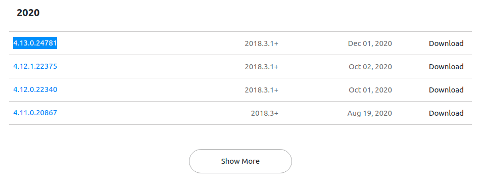

# sonaLint

## 参考资料
* 插件下载地址: https://www.sonarlint.org/intellij
* 社区版下载地址(免费): https://www.sonarqube.org/success-download-community-edition/

推荐使用2020的版本:

下载完成后点击Android Studio的"File" -> "Settings" -> "Plugins" -> 点击"Install"右边的齿轮 -> "Install Plugin from Disk...", 

这里以`sonarlint-intellij-4.13.0.24781.zip`为例进行安装

然后就而已了. 

SonarQube只在服务器上安装可以考虑不装.