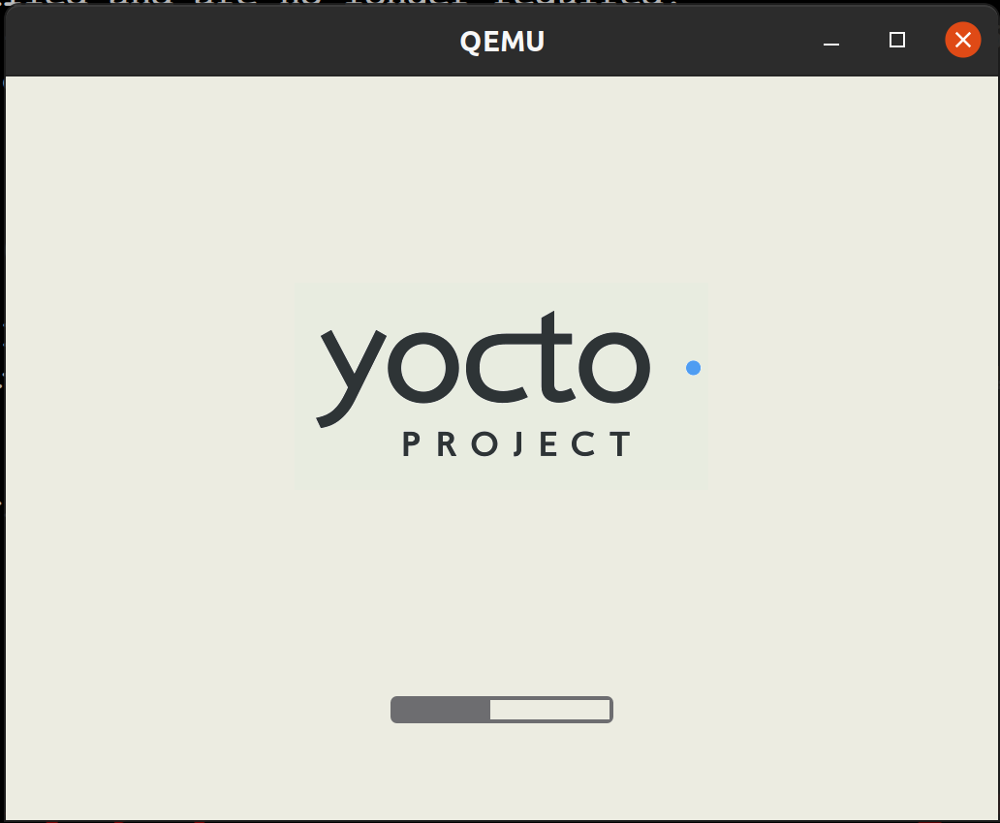
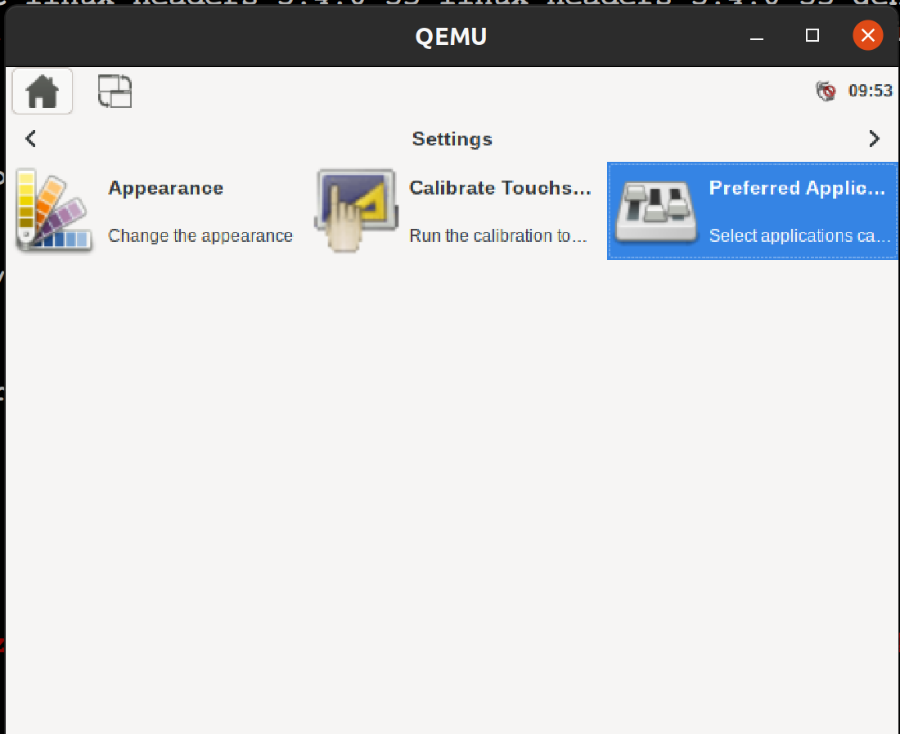

# Yocto

Yocto项目（YP）是一个开源协作项目，可帮助开发人员创建基于Linux的自定义系统，而无需考虑其硬件体系结构。

该项目提供了一套灵活的工具和空间，全世界的嵌入式开发人员可以在其中共享技术，软件堆栈，配置和最佳实践，这些技术，可用于为嵌入式和IOT设备或需要定制Linux OS的地方创建量身定制的Linux映像.

# 准备
参考: https://docs.yoctoproject.org/brief-yoctoprojectqs/index.html  
必须在构建主机上安装基本主机软件包:
```
$ sudo apt-get install gawk wget git-core diffstat unzip texinfo gcc-multilib build-essential chrpath socat cpio python3 python3-pip python3-pexpect xz-utils debianutils iputils-ping python3-git python3-jinja2 libegl1-mesa libsdl1.2-dev pylint3 xterm python3-subunit mesa-common-dev
```

使用Git克隆Poky:
```
$ git clone git://git.yoctoproject.org/poky
$ cd poky
$ git fetch --tags
$ git tag
$ git checkout tags/yocto-3.2 -b my-yocto-3.2
```

建立镜像:
```
$ cd ~/poky
$ source oe-init-build-env
$ bitbake core-image-sato
$ runqemu qemux86-64
```

效果:


启动后:


下载meta-altera层:
```
$ cd ~/poky
$ git clone https://github.com/kraj/meta-altera.git
```

添加层到bblayers.conf:
```
$ cd ~/poky/build
$ bitbake-layers add-layer ../meta-altera
NOTE: Starting bitbake server...

$ cat conf/bblayers.conf 
# POKY_BBLAYERS_CONF_VERSION is increased each time build/conf/bblayers.conf
# changes incompatibly
POKY_BBLAYERS_CONF_VERSION = "2"

BBPATH = "${TOPDIR}"
BBFILES ?= ""

BBLAYERS ?= " \
  /opt/work/poky/meta \
  /opt/work/poky/meta-poky \
  /opt/work/poky/meta-yocto-bsp \
  /opt/work/poky/build/workspace \
  # 注意这里是通过命令新添加的层
  /opt/work/poky/meta-altera \
  "
```

同样的, 移除层:
```
$ bitbake-layers remove-layer ../meta-altera
NOTE: Starting bitbake server...
```

创建自己的层:
```
$ cd ~/poky
$ bitbake-layers create-layer meta-mylayer
NOTE: Starting bitbake server...
Add your new layer with 'bitbake-layers add-layer meta-mylayer'

$ tree meta-mylayer/
meta-mylayer/
├── conf
│   └── layer.conf
├── COPYING.MIT
├── README
└── recipes-example
    └── example
        └── example_0.1.bb

3 directories, 4 files

$ cat meta-mylayer/recipes-example/example/example_0.1.bb 
SUMMARY = "bitbake-layers recipe"
DESCRIPTION = "Recipe created by bitbake-layers"
LICENSE = "MIT"

python do_display_banner() {
    bb.plain("***********************************************");
    bb.plain("*                                             *");
    bb.plain("*  Example recipe created by bitbake-layers   *");
    bb.plain("*                                             *");
    bb.plain("***********************************************");
}

addtask display_banner before do_build
```

添加创建的层:
```
$ cd ~/poky/build/
$ bitbake-layers add-layer ../meta-mylayer/
NOTE: Starting bitbake server...

$ bitbake example
Loading cache: 100% |
...
OTE: Executing Tasks
***********************************************
*                                             *
*  Example recipe created by bitbake-layers   *
*                                             *
***********************************************
NOTE: Tasks Summary: Attempted 525 tasks of which 509 didn't need to be rerun and all succeeded.
```